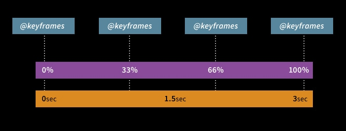
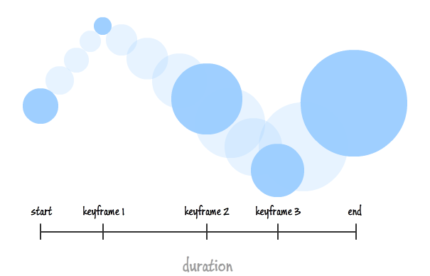

# Animation CSS

Antes de iniciar é melhor relembrar a propriedade `transition`

- `transition-property`
- `transition-duration`
- `transition-delay`
- `transition-timing-function`

A `transition` é usada quando queremos fazer a animação entre um estado e outro. 
- Quando temos 2 estados de um botão, por exemplo, temos um botão no estado normal, e outro no estado `hover`
- Temos 2 estados, e esses 2 estados podem ter , propriedades diferentes.
- Imagina que temos um botão com azul de `background`, mas quando passamos o mouse, esse botão passa a ser vermelho.
- Podemos fazer essa mudança de estado de maneira mais dura, direta, ou podemos fazer uma transição entre esses 2 estados, essas 2 propriedades.

É importante percebemos que uma transição, sempre fará essa mudança, entre 2 estados. De um *estado 1* para um *estado 2*.

### Para a transição funcionar, precisamos de um evento disparador

Sempre precisaremos de algum evento que irá mudar o estado natural de um elemento, a largura, cor de background, posição... E um `transition` fará essa mudança de forma suave
- Esse evento pode ser:
    - `focus` no campo do formulário;
    - `hover` sobre um link;
    - `active`em um botão;
    - Ou mesmo o JavaScript;
    - Entre outros...

Mas que sempre haverá um disparador.

Como fazer para que as animações não dependam de um evento?

## Animation & Keyframes

Usamos o **Keyframes** para criar uma animação e com a propriedade **Animation** aplicamos a aplicação criada no elemento. 

| **transition** | **animation**|
|-------------|-----------|
|- apenas para transições simples(sem keyframes)|- transições complexas(com um ou mais keyframes)|
|- dependem da interação do usuário (:hover, :focus, :active) ou do JavaScript para adicionar/remover uma classe|- não dependem da interação do usuário(mas ainda podemos animar com JavaScript - adicionar/remover classes)|
|   |- maior controle sobre a animação criada|

## Timeline

A imagem acima representa uma Timeline. Temos uma linha de tempo que vale 3 segundos.
- Nessa linha tempo, temos 4 quadro chaves(keyframes);
- Cada **keyframe**, vale um 1 segundo;

As definições das **keyframes** serão sempre em porcentagem, mas o que vai determinar quanto tempo irá durar cada definição, não está nas definições dos **keyframes**, mas sim o tempo da **Timeline** (o tempo da **animação**)

Na imagem acima, temos alguns **keyframes**, e entre esses **keyframes** temos os **frames**.
- A quantidade de **frames** entre cada **keyframes** depende do tempo da animação.
    - Se tiver um tempo de animação maior, a quantidade de **frames** entre cada **keyframes** será maior.

- A responsabilidade do animador é criar os **keyframes**. A quantidade de **frames** intermediários, será gerado pelo browser.

#### Ou seja, keyframes nada mais são que os pontos intermediários para que a animação aconteça.

## Dicas

||
|--------|
|- Somente valores numéricos podem ser animados. Ex.: 10px, .5, 58%, 10em, #cf0, red... Valores como auto, arial, hidden, none, entre outros... Não são valores numéricos e não podem ser animados.|
|- Propriedades mais perfomáticas para animação são: transform e opacity.|
|- Se preciso, utlize will-change para tentar melhorar a perfomance da animação|

# [Menu HTML/CSS](../readme-HTML.md)

## [keyframes e Animations](keyframes_animation.md)

## [will-change](will-change.md)

## [steps()](steps.md)
