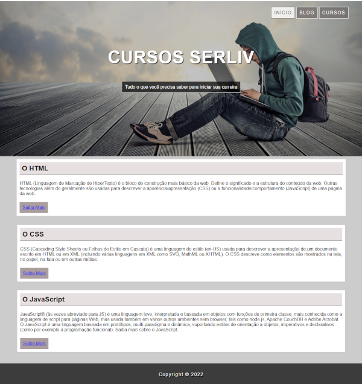

# Projeto Cursos Serliv

Projeto-01 do curso de desenvolvimento da [SERLIV](https://serliv.com/). Projeto trata de conceitos básicos do **HTML** e **CSS** com foco maior em **box-model**.

<h2> 🚀 Tecnologias</h2>

 
    
    

## HTML

- [Código HTML](index.html)

## CSS

- [Código CSS](style.css)

### [Menu Estrutura Semântica e Posicionamento](../menu.md)