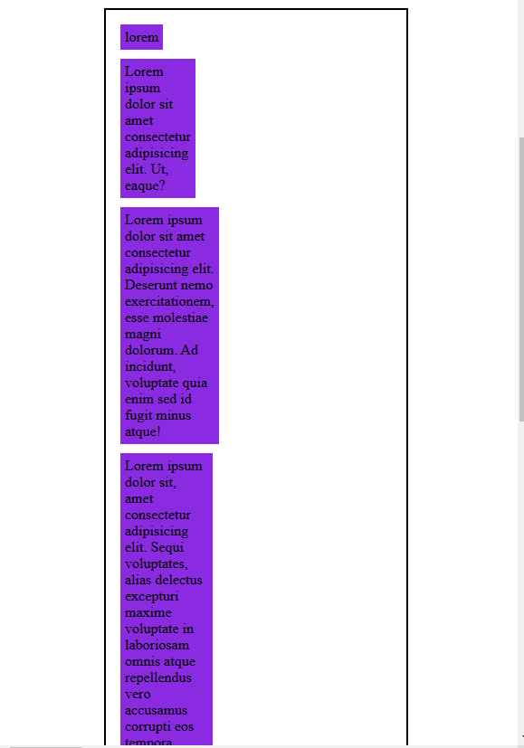
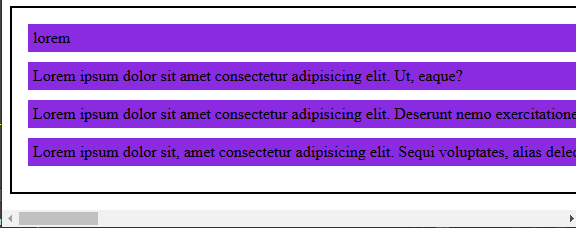
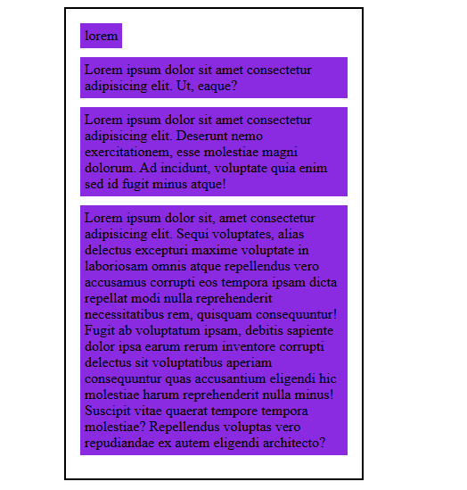

# Entendendo `fit-content`, `max-content` e `min-content` em CSS

Essas propriedades CSS são usadas para definir o tamanho de um elemento com base em seu conteúdo. Vamos entender cada uma:

## `min-content`

- **Definição**: Representa o tamanho mínimo necessário para um elemento conter seu conteúdo sem overflow.
- **Comportamento**: O elemento será sempre tão pequeno quanto possível para acomodar seu conteúdo.

### Exemplo de código:

```
.minContent .item {
    width: min-content;
}
```



Neste exemplo, o elemento `.item` terá a largura mínima necessária para um elemento conter seu conteúdo.

## `max-content`

- **Definição**: Representa o tamanho máximo necessário para um elemento que contenha todo o seu conteúdo, sem qualquer quebra de linha ou corte.
- **Comportamento**: O elemento será tão grande quanto o tamanho máximo necessário para que o elemento contenha todo o seu conteúdo.

### Exemplo de código:

```
.maxContent .item {
    width: max-content;
}
```



Neste exemplo, o elemento `.item` terá a largura do seu conteúdo, mas nunca ultrapassará 80% da largura do contêiner.

## `fit-content`

- **Definição**: É um valor sonoro que se adapta ao espaço disponível.
- **Comportamento**: O elemento terá o tamanho máximo entre e `min-content`o espaço disponível. Se o espaço disponível for menor que `min-content`, o elemento terá o tamanho de `min-content`. Caso contrário, terá o tamanho do espaço disponível.

### Exemplo de código:

```
.fitContent .item {
    width: fit-content;
}
```



Neste exemplo, o elemento `.element` terá a largura do seu conteúdo.

### Exemplo prático

Imagine um elemento com o texto "Este é um texto longo".

- **`*min-content*`**: O elemento terá a largura mínima necessária para mostrar todo o texto em uma única linha.
- **`max-content`**: O elemento terá a largura máxima necessária para mostrar todo o texto sem quebrar a linha.
- **`fit-content`**: O elemento terá uma largura de conteúdo, mas não excederá a largura disponível do contêiner.

Quando usar cada propriedade

- **`*min-content*`**: Quando você quer garantir que um elemento nunca seja menor que seu conteúdo.
- **`max-content`**: Quando você quer que um elemento tenha o tamanho máximo possível sem quebrar o conteúdo.
- **`fit-content`**: Quando você quiser que um elemento se adapte ao espaço disponível, mas tenha um tamanho mínimo garantido.

**Importante**: Essas propriedades são frequentemente usadas em conjunto com outras propriedades como `width`,`height` ,`min-width` ,`max-width` para criar layouts flexíveis e responsivos.

### [Menu Estrutura Semântica e Posicionamento](menu.md)