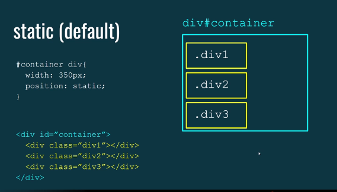
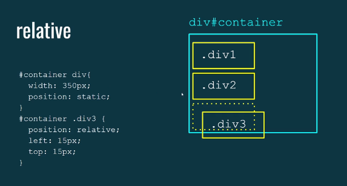
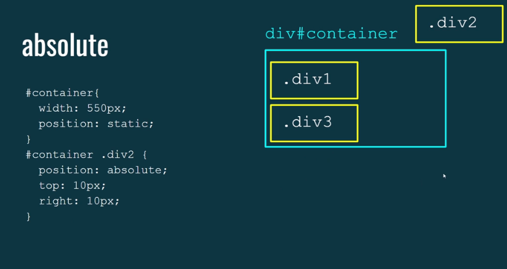
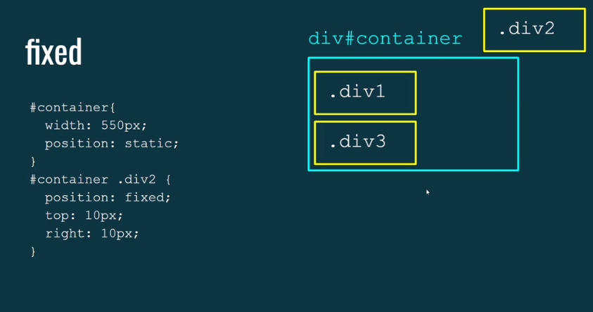

# Tutorial Completo sobre a Propriedade `position` no CSS

## O que é a propriedade `position`?

A propriedade `position` em CSS controla o posicionamento de um elemento em relação aos seus pais, irmãos ou à janela do navegador. Ela é fundamental para criar layouts complexos e efeitos visuais personalizados.

### Os valores da propriedade `position`

A propriedade `position` possui cinco valores principais:

### 1. static: (padrão)



- O elemento está posicionado de acordo com o fluxo normal do documento.
- As propriedades `top`,`right` ,`bottom` e `left` não têm efeito.  

### 2. relative:



- O elemento está posicionado de acordo com o fluxo normal, mas você pode ajustá-lo usando as propriedades `top`,`right` ,`bottom` e  `left`.  
- O elemento mantém seu espaço original no layout, ou seja, outros elementos não ocupam seu lugar.

### 3. absolute:



- O elemento é removido do fluxo normal do documento.
- É posicionado em relação ao primeiro ancestral posicionado (pai, avô, etc. ) com um valor de `position` diferente de `static` ou `relative`, ou em relação à janela do navegador se não houver nenhum ancestral posicionado.

### 4. fixed:



- Da mesma forma que o `absolute`, mas o elemento é posicionado em relação à janela do navegador e permanece fixo enquanto você rola a página.

### 5. sticky:

- Uma combinação de `relative` e `fixed`. O elemento age como `relative` até que alcance um determinado ponto na viewport, a partir daí ele se como `fixed`.

### Exemplos práticos

### Position: relative

```
.box {
  position: relative;
  top: 20px;
  left: 30px;
  background-color: blue;
}
```

Neste exemplo, a caixa será deslocada 20 pixels para baixo e 30 pixels para a direita em relação à sua posição original.

### Position: absolute

```
.container {
  position: relative;
}

.box {
  position: absolute;
  top: 0;
  right: 0;
  background-color: red;
}
```

A caixa vermelha será posicionada no canto superior direito do elemento `.container`.

### Position: fixed

```
.navbar {
  position: fixed;
  top: 0;
  left: 0;
  width: 100%;
  background-color: green;
}
```

A barra de navegação será incluída no topo da página, independentemente da rolagem.

### Position: sticky

```
.header {
  position: sticky;
  top: 0;
  background-color: purple;
}
```
O cabeçalho será fixado no topo da página quando você rolar para baixo, mas voltará ao seu lugar original quando você rolar para cima.

### Quando usar cada valor?

- **static**: Use para elementos que seguem o fluxo normal do documento.
- **relativo**: Use para ajustar levemente a posição de um elemento em relação à sua posição normal.
- **absoluto**: Use para posicionar elementos em relação a um ancestral posicionado ou à janela do navegador.
- **fixed**: Use para criar elementos que permaneçam fixos na tela enquanto você rola.
- **sticky**: Use para criar elementos que se comportam como relativeaté um determinado ponto e depois se comportam como `fixed`.

### Dicas adicionais

- **Índice Z**: Uma propriedade `z-index` que controla a ordem de empilhamento dos elementos quando eles se sobrepõem.
- **Overflow**: A propriedade `overflow` controla o que acontece quando o conteúdo de um elemento ultrapassa suas dimensões.
- **Combinando posições**: Você pode combinar valores diferentes `position` para criar layouts complexos.

### [Menu Estrutura Semântica e Posicionamento](menu.md)