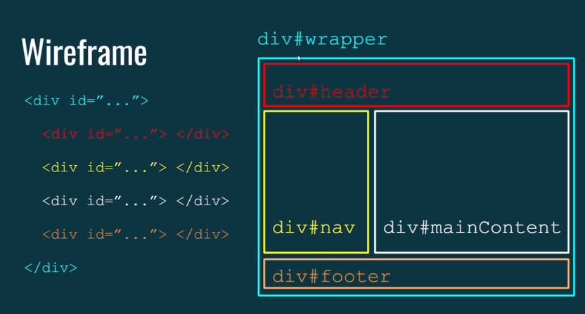
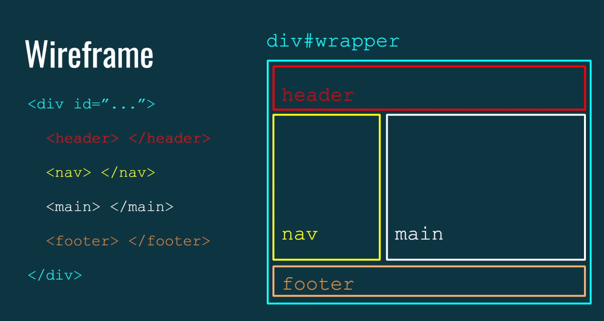
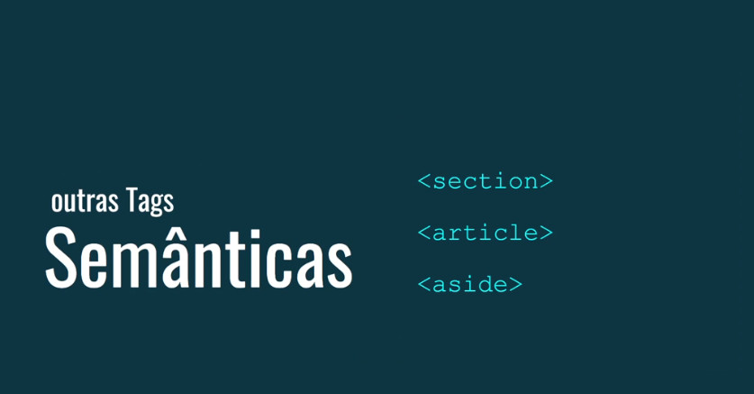
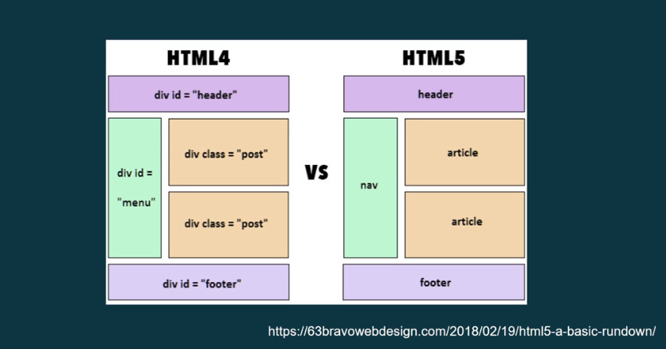

# Tutorial: Estrutura Semântica e Posicionamento em HTML5

## 1. *Introdução à Estrutura Semântica*

Antes do **HTML5**, o desenvolvimento de layouts para sites era feito basicamente com `
` e ``, que não traziam significado ao conteúdo. Isso tornava difícil para os motores de busca e para tecnologias assistivas entenderem a estrutura da página.

Com o **HTML5**, surgiram várias tags semânticas que ajudam a dar significado ao conteúdo, melhorando a acessibilidade e a indexação pelos motores de busca.

## 2. *Principais Tags Semânticas*

- **`<header>`**: Usada para definir a seção de cabeçalho de um documento ou de uma seção específica. Geralmente contém o título, logotipo, ou informações de navegação.

- **`<nav>`**: Representa uma seção do documento destinada à navegação. Contém links para outras páginas ou seções dentro do mesmo site.

- **`<main>`**: Indica o conteúdo principal do documento. Deve ser usado apenas uma vez por página e não deve incluir cabeçalhos, rodapés ou navegação.

- **`<footer>`**: Define o rodapé de um documento ou seção. Pode conter informações como direitos autorais, links relacionados ou informações de contato.

## 3. *Outras Tags Semânticas Importantes*

- **`<section>`**: Utilizada para agrupar conteúdo tematicamente relacionado. Cada seção pode ter seu próprio cabeçalho.

- **`<article>`**: Representa um conteúdo independente que pode ser distribuído ou reutilizado, como uma postagem de blog ou um artigo de notícias.

- **`<aside>`**: Usada para conteúdo relacionado, mas que não é essencial ao entendimento da página principal, como barras laterais com informações adicionais.

## 4. *Tags Não Semânticas*

- **`
`**: Uma tag genérica usada para agrupar elementos sem fornecer significado específico. É útil para aplicar estilos, mas não ajuda na compreensão do conteúdo.

- **``**: Similar ao `
`, mas é uma tag em linha (inline) usada principalmente para estilização de partes do texto.

## 5. *Importância das Tags Semânticas*

As tags semânticas são essenciais por vários motivos:

- **Para Motores de Busca**: Elas ajudam os motores de busca a entenderem melhor o conteúdo da página, o que pode melhorar o SEO (Search Engine Optimization). Com uma estrutura semântica clara, seu site tem mais chances de aparecer nas primeiras posições dos resultados de busca.

- **Para Acessibilidade**: Usuários que utilizam leitores de tela ou outras tecnologias assistivas se beneficiam das tags semânticas, pois elas fornecem contexto sobre a estrutura da página, tornando a navegação mais fácil e intuitiva.

### Conclusão

A transição do uso excessivo de `
` e `` para tags semânticas no **HTML5** traz grandes benefícios tanto para desenvolvedores quanto para usuários finais. Ao utilizar tags semânticas adequadamente, você melhora a acessibilidade do seu site e potencializa sua visibilidade nos motores de busca.

### [Menu Estrutura Semântica e Posicionamento](menu.md)

