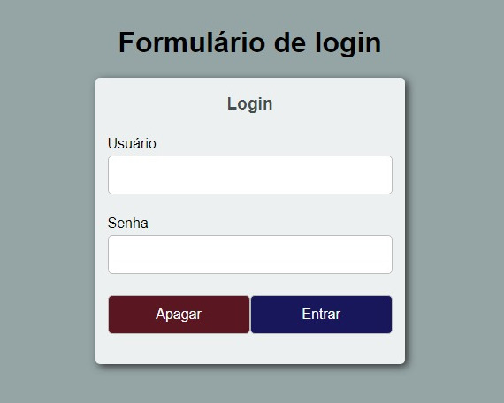

```
HTML

<h1>Formulário de login</h1>
    <form action="#" method="get">
        <fieldset>
            <legend>Login</legend>

            <label for="user">Usuário</label>
            <input type="text" id="user" required autofocus>

            <label for="pass">Senha</label>
            <input type="password" id="pass" required>

            <div class="actions">
                <input type="reset" value="Apagar" class="btn btn__reset">
                <input type="submit" value="Entrar" class="btn">
            </div>
        </fieldset>
    </form>
```

```
CSS

html {
    background-color: #95a5a6;
    font-family: "Helvetica Neve", Arial, sans-serif;
}
body {
    display: flex;
    flex-direction: column;
    justify-content: center;
    align-items: center;
    min-height: 100vh;
    margin: 0;
}
form {
    width: 350px;
    background-color: #ecf0f1;
    border-radius: 5px;
    box-shadow: 3px 3px 10px #333;
}
fieldset {
    border: none;
}
label {
    margin-bottom: .25em;
}
input, label {
    display: block;
    width: 100%;
    box-sizing: border-box;
}
input {
    padding: .75em;
    border-radius: 5px;
    margin-bottom: 1.5em;
    border: 1px solid #bbb;
    font-size: 1em;
}
legend {
    padding: 1em;
    text-align: center;
    font-weight: bold;
    color: #454e4f;
    font-size: 1.2em;
}
.btn {
    background-color: rgb(23, 23, 90);
    color: white;
    cursor: pointer;
}
.actions {
    display: flex;
}
.btn__reset {
    background-color: rgb(90, 23, 34); 
}
```



### [Voltar ao Readme Principal](../README.md)