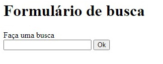
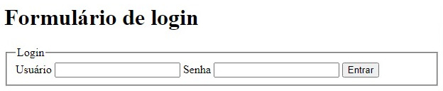

# Formulários HTML: Coletando dados do usuário

Formulários HTML são elementos essenciais em páginas da web que permitem a coleta de dados do usuário para diversas especificidades, como cadastro, contato, pesquisas e muito mais. Esses dados podem ser enviados para um servidor para processamento posterior.

### Tag `<form>` : A estrutura principal

Uma tag `<form>` define o início e o fim de um formulário. Ela possui atributos importantes como:

- **action**: Defina uma URL para onde os dados do formulário serão enviados ao serem enviados.
- **method**: Especifica o método HTTP usado para enviar os dados (GET ou POST).
- **name**: Atribui um nome ao formulário para fins de identificação.

### Exemplo:

```
<form action="processa_dados.php" method="post">
  </form>
```

A tag `<input>`: Os campos de entrada
Uma tag `<input>`cria os campos de entrada onde o usuário inserirá os dados. Ela possui um atributo **type** que define o tipo de campo:

- **text**: Campo de texto simples.
- **password**: Campo de senha (os caracteres são mascarados).
- **e-mail**: Campo para endereços de e-mail.
- **number**: Campo numérico.
- **date**: Campo para data.
- **radio**: Botão de opção (somente um pode ser selecionado em um grupo).
- **select**: Caixa de seleção (múltiplas opções podem ser selecionadas).
- **submit**: Botão para enviar o formulário.
- **reset**: Botão para limpar os campos do formulário.

### Exemplo:

```
<form action="processa_dados.php" method="post">
  <label for="nome">Nome:</label>
  <input type="text" id="nome" name="nome">
  <br>
  <label for="email">E-mail:</label>
  <input type="email" id="email" name="email">
  <br>   

  <input type="submit" value="Enviar">
</form> 
```

## A tag `<label>` : Associando rótulos aos campos
A tag `<label>` associa um rótulo a um elemento de formulário, geralmente um `<input>` . O atributo `for` especifica o ID do elemento a ser associado. Essa associação melhora a acessibilidade e a experiência do usuário, pois ao clicar no rótulo, o foco é direcionado automaticamente para o campo correspondente.

### Exemplo:

```
<label for="nome">Nome:</label>
<input type="text" id="nome" name="nome">
```


### Outros elementos importantes

Além de `<form>`, `<input>` e `<label>` , outros elementos comuns em formulários incluem:

- `<textarea>` : Cria um campo de texto multilinha.
- `<select>` : Cria uma lista suspensa.
- `<opção>` : Defina as opções dentro de uma lista suspensa.
- `<button>` : Cria um botão personalizado.

### Exemplo completo de um formulário de contato

```
<form action="processa_contato.php" method="post">
  <label for="nome">Nome:</label>
  <input type="text" id="nome" name="nome" required>
  <br>
  <label for="email">E-mail:</label>
  <input type="email" id="email" name="email"   
 required>
  <br>
  <label for="mensagem">Mensagem:</label>
  <textarea id="mensagem" name="mensagem" required></textarea>
  <br>
  <input type="submit" value="Enviar   
 Mensagem">
</form>
```

### Exemplo de um formulário, estilo formulário de busca do Google

```
<h1>Formulário de busca</h1>
    <label for="busca">Faça uma busca</label>
    <form action="https://www.google.com/search" method="get" target="_blank">
        <input type="text" name="q" id="busca">
        <input type="submit" value="Ok">
    </form>
```



### Exemplo de formulário de login

```
<h1>Formulário de login</h1>
    <form action="#" method="get">
        <fieldset>
            <legend>Login</legend>

            <label for="user">Usuário</label>
            <input type="text" id="user" required autofocus>

            <label for="pass">Senha</label>
            <input type="password" id="pass" required>

            <input type="submit" value="Entrar">
        </fieldset>
    </form>
```

- `<fieldset>`: Forma um grupo de entrada de dados;
- `<legend>`: Título para o formulário;



### Observações:

- O atributo `autofocus` dá foco inicial ao compo que deve ser preenchido primeiro.
- O atributo `required` indica que o campo é obrigatório.
- A validação dos dados do formulário geralmente é feita no lado do servidor (por exemplo, em PHP).
- É importante usar CSS para estilizar os formulários e torná-los mais atraentes.

### [Voltar ao Readme principal](../README.md)