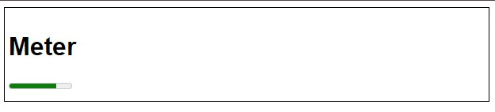
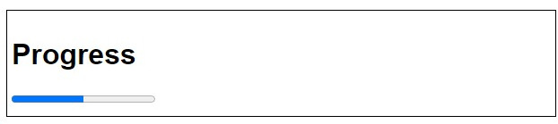

#  `<meter>` e `<progress>`

As tags `<meter>`e `<progress>`são elementos HTML5 que servem para apresentar dados numéricos de formato visual, mas com propósitos distintos. Vamos entender cada uma delas:

## `<meter>`: Medindo escalas e valores

A tag `<meter>`é utilizada para representar uma medida escalar dentro de um intervalo conhecido. Ela é ideal para exibir valores como:

- **Uso de recursos**: Porcentagem de bateria, espaço em disco, uso de memória.
- **Resultados de avaliações**: Notas, avaliações de desempenho.
- **Estatísticas**: Proporção de votos, probabilidades.
### Exemplo:

```
<meter min="0" max="100" value="75">75% de bateria</meter>
```



### Atributos importantes:

- **min**: Valor mínimo da escala.
- **max**: Valor máximo da escala.
- **value**: Valor atual.
- **low**: Valor considerado baixo (opcional).
- **high**: Valor considerado alto (opcional).
- **optimum**: Valor considerado ideal (opcional).

Os atributos `low`, `high` e `optimum` permitem que o navegador estilize o medidor de forma diferente dependendo do valor atual. 

## `<progress>`: Indicando progresso de uma tarefa

A tag `<progress>`é utilizada para representar o progresso de uma tarefa, como um download, um upload ou uma operação em andamento. Ela geralmente é apresentada como uma barra que se preenche à medida que a tarefa avança.

### Exemplo:

```
<progress value="50" max="100">50% concluído</progress>
```



### Atributos importantes:

- **value**: Valor atual do progresso.
- **max**: Valor máximo do progresso.

## Diferença entre `<meter>`e `<progress>`:

| Características | `<meter>`| `<progress>`|
|-----------------|----------|-------------|
|Propósito|Medir escalas e valores|	Indicador de progresso de uma tarefa|
|Valentia|Pode ser qualquer valor dentro da escala|Deve ser um valor entre 0 e o valor máximo|
|Visualização|Geralmente uma barra com núcleos que indicam o valor|Geralmente uma barra que se preenche à medida que o valor aumenta|

### Quando usar cada uma?

Use `<meter>`para exibir valores numéricos que não representam um progresso linear, como porcentagens, notas ou estatísticas.
Use `<progress>` para mostrar o andamento de uma tarefa que tem um início e um fim definido, como downloads, uploads ou processamentos.

### Observação:

Ambas as tags podem ser personalizadas com CSS para criar diferentes estilos visuais.

### Em resumo:

As tags `<meter>`e `<progress>` são ferramentas úteis para apresentar dados numéricos de forma visual e intuitiva. Ao escolher a tag correta, você pode melhorar a experiência do usuário e tornar suas aplicações mais informativas.

### [Menu Formulários](menu-formularios.md)