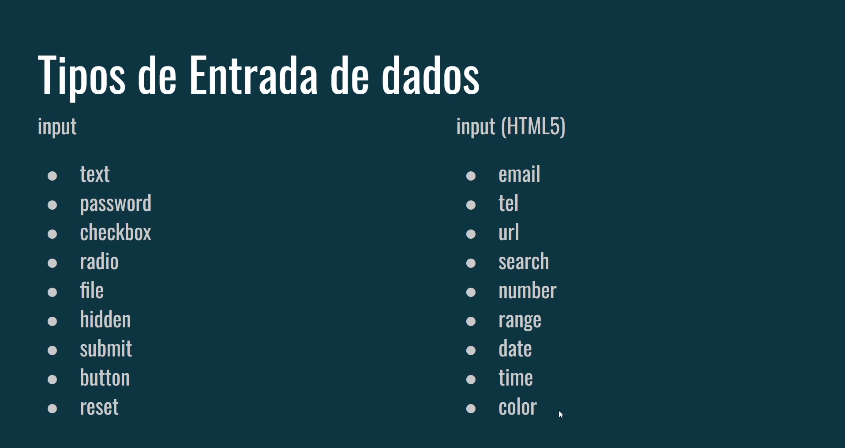
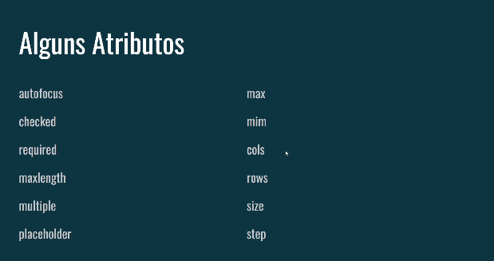

# Semântica em forms


Dentro da tag `form` existem algumas outras tags que estão relacionadas aos formulários

As tags `<fieldset>` são `<legend>` usadas em conjunto dentro de um formulário HTML para agrupar elementos relacionados e fornecer um rótulo claro para esse grupo . Isso torna o formulário mais organizado e fácil de entender, tanto para o usuário quanto para ferramentas de acessibilidade.

### `<fieldset>`

Uma tag `<fieldset>` define um conjunto de elementos relacionados dentro de um formulário. Ela cria uma borda visual (que pode ser personalizada com CSS) que separa o grupo de outros elementos do formulário. Essa separação lógica ajuda a organizar os campos e melhorar a experiência do usuário.

### `<legend>`

Uma tag `<legend>` define um título para o grupo de elementos dentro do `<fieldset>`. Ela geralmente aparece acima do grupo e descreve o propósito dos elementos. Essa legenda é essencial para a acessibilidade, pois muitos leitores de tela anunciam uma legenda antes de descrever os elementos individuais dentro do `<fieldset>`.

## Tipos de entrada de dados



## Outros tipos de entrada de dados que não são tags inputs


- `textarea`: Cria um campo de texto multilinha, ou seja, que permite a entrada de várias linhas de texto. É ideal para campos como comentários, mensagens ou propostas mais extensas.

- `select`: Criar uma lista suspensa (dropdown) ou uma caixa de seleção, permitindo que o usuário escolha apenas uma opção de um conjunto predefinido.

- **`options` e `optgroup`**: São utilizados dentro da tag `<select>` para definir as opções que o usuário pode selecionar.
    - `options`: Cada `<option>` representa uma única opção na lista. O atributo `value` define o valor que será enviado ao servidor quando a opção for **selecionada**.
    - `optgroup`: Grupo de opções relacionadas dentro da lista, tornando-a mais organizada.

- **`details` e `summary`**: Cria um elemento que inicialmente está fechado (oculto) e pode ser expandido pelo usuário clicando no `summary`. É útil para mostrar informações adicionais ou detalhes sobre um assunto específico.

## Formas de visualização de dados


- ### `progress`

    - **Função**: Representa o progresso de uma tarefa, como um download, carregamento de uma página ou qualquer outra operação que tenha um início, meio e fim.
    - **Visualização**: Normalmente é exibida como uma barra que se preenche à medida que a tarefa avança.
    - **Atributos**:
        - `value`: Valor atual do progresso.
        - `max`: Valor máximo do progresso.
    - **Exemplo**:

```
<progress value="30" max="100"></progress>
```

- ### `meter`

    - **Função**: Representa um valor numérico dentro de um intervalo definido. É útil para mostrar métricas como níveis de bateria, desempenho, etc.
    - **Visualização**: Geralmente é exibida como uma barra que se proporciona proporcionalmente ao valor.
    - **Atributos**:
        - `value`: Valor atual.
        - `min`: Valor mínimo do intervalo.
        - `max`: Valor máximo do intervalo.
        - `low`: Valor que indica um nível baixo.
high: Valor que indica um nível alto.
        - `optimum`: Valor que indica o valor ideal.
    - **Exemplo**:

```
<meter value="0.7" min="0" max="1" low="0.2" high="0.8" optimum="0.5"></meter>
```

- ### `output`

    - **Função**: Exibe o resultado de um cálculo ou qualquer outra informação gerada dinamicamente. É comumente usado em conjunto com JavaScript para mostrar resultados de cálculos, validações de formulários, etc.
    - **Visualização**: Pode ser exibido como um texto simples, um número formatado ou qualquer outro tipo de conteúdo.
    - **Exemplo**:

```
<input type="number" id="num1">
<input type="number" id="num2">
<button onclick="calcular()">Calcular</button>
<output id="resultado"></output>

<script>
  function calcular() {
    let num1 = document.getElementById("num1").value;
    let num2 = document.getElementById("num2").value;
    document.getElementById("resultado").value = num1 + num2;
  }
</script>
```
Neste exemplo, o elemento `output` mostrará o resultado da soma dos dois números inseridos.

## Alguns Atributos



### [Menu Formulários](menu-formularios.md)