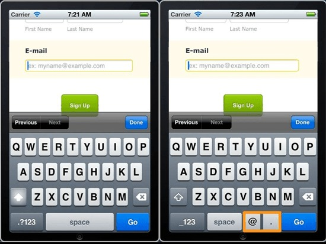
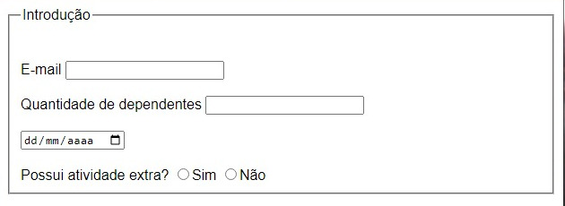
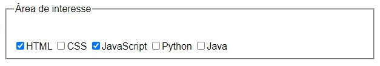
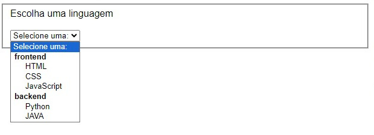
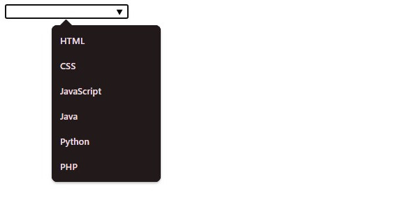
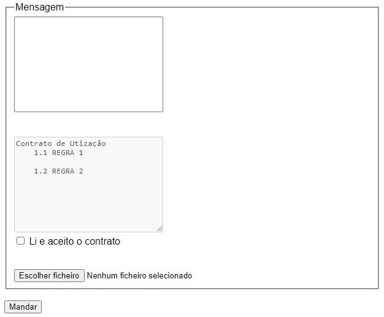
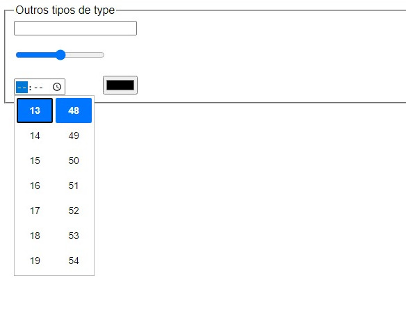
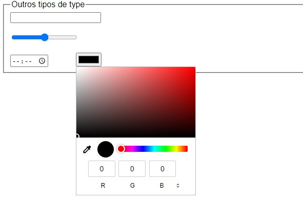

# Tipos de entrada de dados

Ao inserir o type correto dos inputs, o próprio Browser fará uma vericação básica, se o valor inserido pelo usuário, na caixa do formulário, está correta.

#### Existe também uma melhora na usabilidade para o usuário. A entrada correta dos types proporciona que o device customize o teclado para aquele tipo de entrada. 



## Principais tipos de type

- **Email**: `<input type="email">` - Aceita apenas endereços de e-mail válidos.
- **Number**: `<input type="number">` - Permite a entrada de números.
- **Date**: `<input type="date">` - Permite a seleção de uma data.
- **Radio**: `<input type="radio">` - Botões de opção para seleção única.
  - Para escolher apenas uma das opções é necessario o uso do atributo `name`.
  - Envolver o `input` numa `label` ajuda na usabilidade, aumentando o campo de click.
- **Submit**: `<input type="submit">` - Botão para enviar o formulário.

```
<form>
        <fieldset>
            <legend>Introdução</legend>

            <br><br>
            <label for="email">E-mail</label>
            <input type="email" name="email" id="email" required>

            <br><br>
            <label for="dependentes">Quantidade de dependentes</label>
            <input type="number" id="dependentes" min="0">
            
            <br><br>
            <input type="date" min="2024-01-15">
           
            <br><br>
            Possui atividade extra?
            <label><input type="radio" name="atvExtra" value="sim">Sim</label>
            <label><input type="radio" name="atvExtra" value="nao">Não</label>
            
        </fieldset>
</form>
```




- **Checkbox**: `<input type="checkbox">` - Caixas de seleção para múltiplas escolhas.
  - Para melhorar a usabilidade no click, envolver cada `input` num `label`;
  - Necessário o uso do atributo `name` para que os dados sejam enviados para o servidor;
  - O atributo `value` manda o valor que é enviado ao servidor;

```
<fieldset>
    <legend>Área de interesse</legend>

    <br><br>
    <label><input type="checkbox" name="interesse" value="html">HTML</label> 
    <label><input type="checkbox" name="interesse" value="css">CSS</label>
    <label><input type="checkbox" name="interesse" value="javascript">JavaScript</label>
    <label><input type="checkbox" name="interesse" value="python">Python</label>
    <label><input type="checkbox" name="interesse" value="java">Java</label>
</fieldset>
```



- **Select**: `<select>` - Menu suspenso com opções:
  - **Option**: `<option>` - Define uma opção dentro do `<select>`.
  - **Optgroup**: `<optgroup>` - Agrupa opções dentro do `<select>`.
  - **Controls**: Atributo não aplicável diretamente ao `<select>`.
  - **Size**: Define o número de opções visíveis no menu suspenso.

```
<fieldset>
  <label> Escolha uma linguagem <br><br>
      <select name="linguagem">
          <option>Selecione uma:</option>
          <optgroup label="frontend">
              <option value="html">HTML</option>
              <option value="css">CSS</option>
              <option value="javascrpt">JavaScript</option>
          </optgroup>

          <optgroup label="backend">
              <option value="python">Python</option>
              <option value="java">JAVA</option>
          </optgroup>
      </select>
  </label>
</fieldset>    
```



- **Datalist**: `<datalist>` - Lista de opções predefinidas para um campo de entrada.

```
<input type="text" list="linguagemList">
<datalist id="linguagemList">
    <option value="HTML">
    <option value="CSS">
    <option value="JavaScript">
    <option value="Java">
    <option value="Python">
    <option value="PHP">
</datalist>
```




- **Textarea**: `<textarea>` - Área de texto para múltiplas linhas:
  - **Readonly**: Torna o campo somente leitura.
  - **Disabled**: Desabilita o campo, tornando-o não editável.
- **File**: `<input type="file">` - Permite o upload de arquivos.
- **Hidden**: `<input type="hidden">` - Campo oculto que não é visível para o usuário.
- **Button**: `<input type="button">` - Botão clicável.

```
<form>
  <fieldset>
      <legend>Mensagem</legend>
      <textarea style="resize: none;" name="msg" cols="30" rows="10"></textarea>

      <br><br><br>
      <textarea cols="30" rows="10" disabled>
  Contrato de Utização 
      1.1 REGRA 1
      
      1.2 REGRA 2

      </textarea>
      <br>
      <label>
          <input type="checkbox"> Li e aceito o contrato
      </label>

      <br><br><br>
      <input type="file">
  </fieldset>

  <input type="hidden" value="abbcde123">
  <br>
      <input type="submit" value="Mandar">
</form> 
```




- **Search**: `<input type="search">` - Campo de pesquisa.
  - Inclui um **X** para limpar o input.

- **Range**: `<input type="range">` - Controle deslizante para selecionar um valor dentro de um intervalo.

- **Time**: `<input type="time">` - Permite a seleção de um horário.

- **Color**: `<input type="color">` - Permite a seleção de uma cor.

```
<fieldset>
    <legend>Outros tipos de type</legend>
    <input type="search">
    <br><br>
    <input type="range" min="0" max="10">
    <br><br>
    <input type="time" style="margin-right: 50px;">
    
    <input type="color">
</fieldset>
```




### [Menu Formulários](menu-formularios.md)