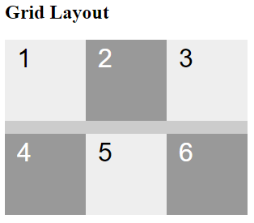
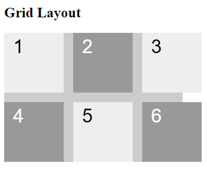

# `row-gap` e `column-gap`

**row-gap** e **column-gap** são propriedades CSS que definem o espaço entre as linhas e colunas, respectivamente, em um layout Grid. Elas são ferramentas essenciais para criar layouts mais organizados e personalizados.

## `row-gap`

- **Função**: Definir o espaço entre as linhas de um contêiner de grade.
- **Sintaxe**:

```
row-gap: 16px;
```



- Definiu um espaço de 16px entre as **linhas** do contêiner;

## `column-gap`

- **Função**: Definir o espaço entre as colunas de um contêiner de grade.
- **Sintaxe**:

```
column-gap: 16px;
```



- Definiu um espaço de 16px entre as **colunas** do contêiner;

## `gap`

- **Abreviação** `gap`: As propriedades `row-gap`e `column-gap` podem ser combinadas na propriedade `gap`. 
- **Por exemplo**: 
    - `row-gap: 16px;` e `column-gap: 16px;` 
    - É o equivalente a `gap: 16px`;

### Observação

- **Valores negativos**: Embora não sejam muito comuns, valores negativos podem ser usados ​​para sobrepor elementos adjacentes.

### [Menu Layout CSS](menu-introducao.md)