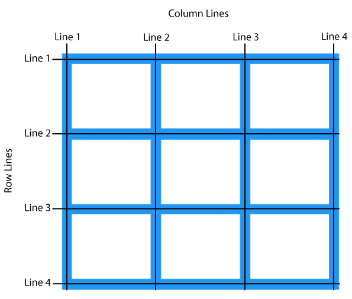
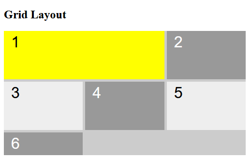
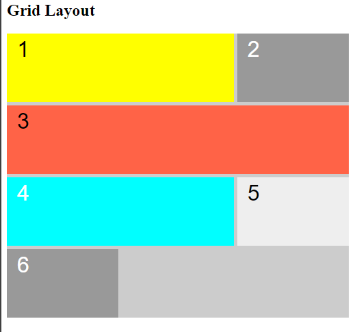
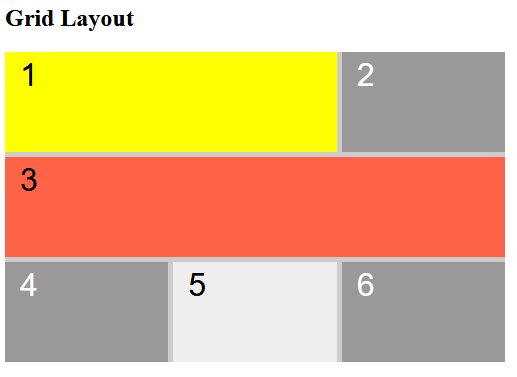

# Entendendo as Propriedades `grid-row-start` , `grid-row-end`, `grid-column-start` e `grid-column-end`

## O que elas fazem?

- **`grid-row-start` e `grid-row-end`**: Determinam a linha inicial e final, respectivamente, onde um item deve se estender no eixo vertical da grade.
- **`grid-column-start` e `grid-column-end`**: Determinam a coluna inicial e final, respectivamente, onde um item deve se estender no eixo horizontal da grade.



**Em resumo**: Essas propriedades nos permitem definir a posição exata de um item dentro da grade, controlando `column-lines` e `row-lines` ele ocupará.

### Como utilizá-las?

```
.gridItem:nth-child(1) {
    background-color: yellow;
    grid-row-start: 1;
    grid-row-end: 2;
    grid-column-start: 1;
    grid-column-end: 3;
}
```



### Valores possíveis:

- **Números**: Indicam a linha ou coluna específica.
- `span <número>`: Faz o item ocupar um número específico de linhas ou colunas a partir de sua posição inicial.
- `-1`: Indica a última linha ou coluna do grid.
- `-2`: Indica a penúltima linha ou coluna do grid.
- **auto**: O item ocupará apenas o espaço necessário.
- **Nomes de linhas ou colunas**: Se você nomear suas linhas e colunas, pode usar esses nomes como referência.

### `span <número>`

- Faz o item ocupar um número específico de linhas ou colunas a partir de sua posição inicial.

```
.gridItem:nth-child(4) {
    background-color: aqua;
    grid-row: 3 / -2;
    grid-column: 1 / span 2;
}
```



- O **elemento 4** iniciou na linha e ocupou duas colunas

## As propriedades `grid-row` e `grid-column` 

As propriedades `grid-row` e `grid-column` 
são atalhos que combinam `start` e `end` em uma única declaração:

```
.gridItem:nth-child(3) {
    background-color: tomato;
    grid-row: 2 / -2;
    grid-column: 1 / -1;
}
```



### [Menu Layout CSS](menu-introducao.md)