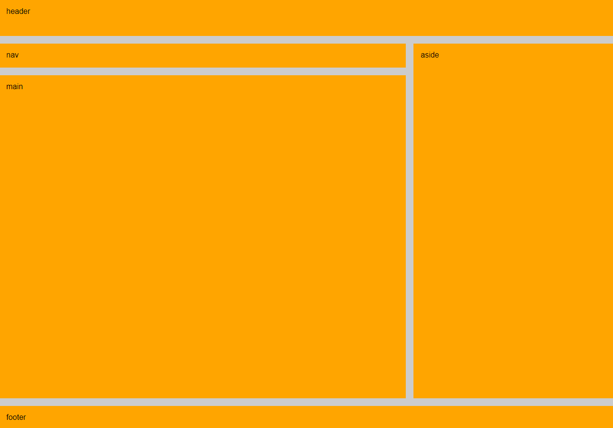

# Propriedade `grid-template-areas` no CSS Grid: Criando Layouts Flexíveis e Intuitivos

A propriedade grid-template-areas é uma ferramenta poderosa no CSS Grid que permite criar layouts complexos de forma muito mais intuitiva e organizada.

## O que é `grid-template-areas`?

Imagine que você está montando um quebra-cabeça. Cada peça tem um desenho único e você precisa encaixá-las de forma específica para formar uma imagem completa. A propriedade `grid-template-areas` funciona de maneira semelhante, mas no contexto de um layout CSS Grid.

- **Áreas Nomeadas**: Com essa propriedade, você pode dar nomes a diferentes áreas dentro de sua grade.
- **Mapeamento de Elementos**: Em seguida, você associa cada elemento HTML a uma dessas áreas nomeadas.
- **Flexibilidade**: Ao modificar os nomes das áreas, você pode reorganizar completamente o layout sem precisar alterar o HTML ou o CSS dos elementos individuais.

### Como Funciona na Prática?

```
HTML

<div class="gridContainer">
    <header class="header gridItem">header</header>
    <nav class="nav gridItem">nav</nav>
    <aside class="aside gridItem">aside</aside>
    <main class="main gridItem">
        main
    </main>
    <footer class="footer gridItem">footer</footer>
</div>
```

```
CSS

.gridContainer {
    display: grid;
    grid-template-columns: repeat(3, 1fr);
    grid-template-rows: 75px 50px 1fr 50px;
    gap: 1em;

    grid-template-areas: 
    "header header header"
    "nav nav aside"
    "main main aside"
    "footer footer footer";
}
.header {
    grid-area: header;
}
.nav {
    grid-area: nav;
}
.aside {
    grid-area: aside;
}
.main {
    grid-area: main;
}
.footer {
    grid-area: footer;
}
```

## Visualizando o Layout:



### Explicando o Código:

- **grid-template-areas**: Definir como áreas do grid. Cada linha representa uma linha da grade, e as palavras dentro das aspas representam os nomes das áreas.
- **grid-area**: Associa cada elemento HTML à área correspondente no grid.

### Vantagens de Usar `grid-template-areas`:

- **Maior Clareza**: A organização do layout fica mais visual e fácil de entender.
**Flexibilidade**: Permite criar layouts complexos e adaptáveis ​​a diferentes tamanhos de tela.
- **Manutenção Simplificada**: Facilita a alteração e o reordenamento dos elementos.

### Considerações Adicionais:

- **Sobreposição de Áreas**: Você pode sobrepor áreas para criar efeitos interessantes, como elementos que se estendem por várias linhas ou colunas.
- **Combinação com Outras Propriedades**: `grid-template-areas` pode ser combinada com outras propriedades do CSS Grid, como `grid-template-columns`e `grid-template-rows`, para criar layouts ainda mais personalizados.

### Em Resumo:

A propriedade `grid-template-areas`é uma ferramenta fundamental para quem deseja criar layouts responsivos e flexíveis utilizando o CSS Grid. Ao entender como ela funciona, você poderá criar designs mais sofisticados e organizados para seus projetos web.

### [Menu Layout CSS](menu-introducao.md)