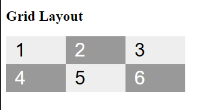
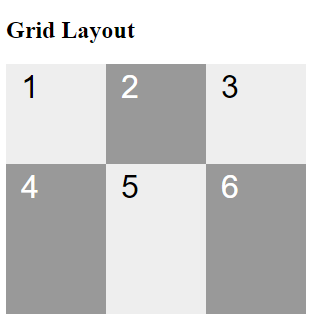

# Propriedades `grid-template-columns` e `grid-template-rows`

Essas propriedades CSS são usadas para definir a estrutura de colunas e linhas em um contêiner de grade.

## Definindo Grid como display

```
.gridContainer {
    display: grid;
}
```

## `grid-template-columns`

- **Função**: Definir a largura e o número de colunas em um contêiner grid.

- **Sintaxe**:

```
grid-template-columns: 100px 100px 100px;
```



- Foi definido 3 colunas de 100px cada;


## `grid-template-rows`

- **Função**: Definir a altura e o número de linhas em um contêiner de grade.

- **Sintaxe**:

```
grid-template-rows: 100px 150px;
```



- Foi definido 2 linhas, uma de 100px e outra de 150px;

## A função `repeat()`

Quando precisarmos criar mais de uma linha ou coluna com a mesma dimensão, utilize a função `repeat()` para não ter que ficar escrevendo várias vezes. Primeiro indicamos o número de repetições e depois, o valor a ser repetido.

```
.gridContainer {
    display: grid;
    grid-template-columns: repeat(2, 75px) 150px;
    grid-template-rows: repeat(2, 100px);
}
```

### [Menu Layout CSS](menu-introducao.md)