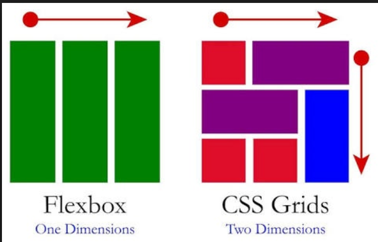
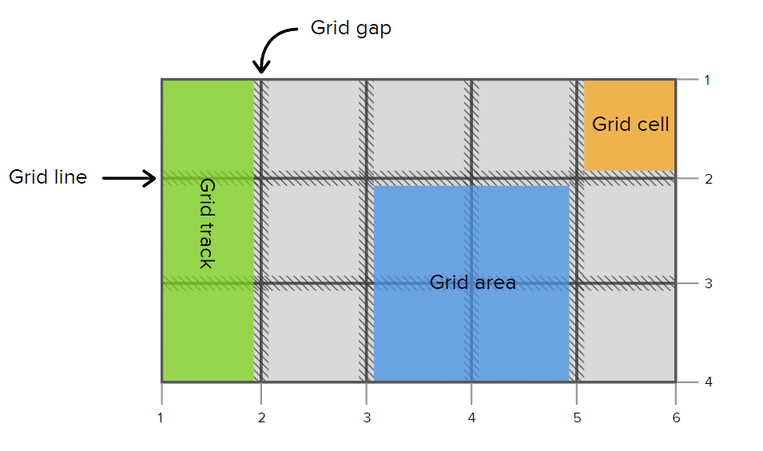

# GRID CSS

## O Que É CSS Grid?

O CSS Grid é um sistema de estruturação de layout que o CSS nos fornece. Diferente do Flexbox, que apenas nos permite trabalhar em uma única dimensão, o CSS Grid nos permite configurar layouts em duas dimensões (linhas e colunas). A junção de linhas e colunas formam uma grade, o que dá o nome a esse sistema (Grid).

## Layout Grid

O **Layout Grid** permite que você organize elementos em uma estrutura de linhas e colunas. Aqui estão algumas das propriedades principais:

## Grid Line

- **Definição**: São as linhas invisíveis que definem os limites das colunas e linhas em uma grade.
    - **A linha que dividi(separa) cada grid cell, pode ser tanto a linha x quanto y**
- **Uso**: Você pode referenciar linhas de grade para posicionar elementos dentro da grade.

## Grid Track

- **Definição**: É o espaço entre duas linhas de grade adjacentes. Pode ser uma linha ou uma coluna.
- **Uso**: Você pode definir o tamanho e as propriedades de um grid track usando propriedades como:
    - `grid-template-rows`
    - `grid-template-columns`

## Grid area

- **Definição**: É um espaço definido por quatro linhas de grade, formando um retângulo.
- **Uso**: Você pode posicionar elementos em uma área específica da grade usando a propriedade 
    - `grid-placement`

## Grid Cell

- **Definição**: É a interseção de uma linha e uma coluna em uma grade.
- **Uso**: Você pode referenciar células da grade para posicionar elementos dentro da grade.

## Grid gap

- **Definição**: É o espaço entre as trilhas da grade, tanto na horizontal quanto na vertical.
- **Uso**: Você pode definir o tamanho do grid gap usando as propriedades: 
    - `row-gape` 
    - `column-gap`

# [Menu HTML/CSS](../readme-HTML.md)

- ## [Grid tamplate Rows e Columns](grid-tamplate-rows_columns.md)

- ## [row-gap e column-gap](gap.md)

- ## [Grid-area](grid-area.md)

- ## [grid-tamplate-areas](grid-tamplate-areas.md)

- ## [grid-template & Nomeando grid-lines](#grid-template--nomeando-grid-lines)

- ## [grid-auto-rows e função minmax()](grid-auto-rows_minmax.md)

- ## [Auto-fll e auto-fit](auto-fill_autofit.md)

- ## [grid-auto-flow e grid-autocolumns](#grid-auto-flow-e-grid-autocolumns)