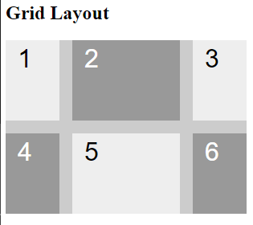
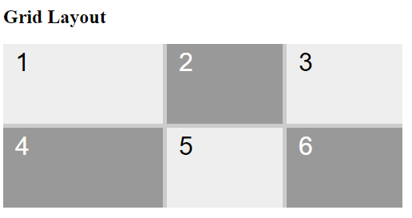
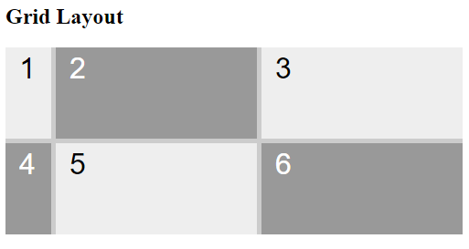

# A Unidade `fr` no CSS Grid: Criando Layouts Flexíveis

A unidade `fr` é uma ferramenta poderosa no CSS Grid para criar layouts que se adaptam de forma flexível ao tamanho da tela. Ela representa uma **fração** do espaço disponível dentro de uma grade de contêineres.

### Como funciona:

- **Divisão Proporcional**: Ao usar `fr` , você divide o espaço disponível entre as colunas ou linhas de acordo com as proporções definidas.
- **Flexibilidade**: A unidade `fr` permite que o layout seja ajustado automaticamente a diferentes tamanhos de tela, mantendo as proporções definidas.

### Exemplo:

```
grid-template-columns: 1fr 2fr 1fr;
```



### Neste exemplo:

- O contêiner será dividido em três colunas.
- A primeira e a terceira coluna ocuparão 1/4 do espaço disponível cada uma.
- A segunda coluna ocupará 2/4 do espaço disponível.

### Quando usar:

- **Layouts responsivos**: A unidade `fr` é ideal para criar layouts que se adaptem a diferentes tamanhos de tela, como dispositivos móveis e desktops.
- **Layouts flexíveis**: Quando você precisa que as colunas ou linhas se ajustem de acordo com o conteúdo, a unidade `fr` é a escolha certa.
- **Proporções definidas**: Se você precisa manter uma proporção específica entre as colunas ou linhas, a unidade `fr` permite definir essas proporções de forma fácil.

### Vantagens da unidade `fr`:

- **Flexibilidade**: Cria layouts que se adaptam a diferentes tamanhos de tela.
- **Facilidade de uso**: A sintaxe é simples e intuitiva.
- **Manutenção**: Facilita a manutenção do código, pois as proporções são definidas de forma clara.

## Combinando `fr` com outras unidades: Flexibilidade máxima nos seus layouts

A grande força do CSS Grid é sua flexibilidade. A unidade `fr` é fundamental para criar layouts responsivos, mas combiná-la com outras unidades como `px`,`em`,`rem` e `minmax()` abre um leque ainda maior de possibilidades. 

### Por que combinar `fr` com outras unidades?

- `minmax()`: Garante que um elemento tenha um tamanho mínimo ou máximo, mesmo em layouts responsivos.
- **Tamanhos fixos**: Permite combinar elementos com tamanhos fixos com elementos que se adaptam ao espaço disponível.
- **Layouts híbridos**: Cria layouts que combinam elementos com tamanhos fixos e flexíveis.

### Exemplos:

### 1. `minmax()`

```
.gridContainer {
    display: grid;
    grid-template-columns: minmax(200px, 1fr) 1fr 1fr;
}
```



A primeira coluna terá no mínimo 200px e será expandida para ocupar o espaço restante se houver espaço disponível.

### 2. Tamanho fixo e flexível:

```
grid-template-columns: 50px 1fr 1fr;
```



A primeira coluna terá 50px de largura e a segunda e terceira colunas ocuparam o espaço restante.

### Quando usar cada combinação:

- **`fr`com `px`, `em` ou `rem`**: Ideal quando você precisa de um elemento com um tamanho mínimo garantido, mas que também se expande se houver espaço.
- **`fr`com `minmax()`**: Perfeito para criar layouts mais complexos, com múltiplas restrições de tamanho.

### Considerações importantes:

- **Ordem das unidades**: A ordem em que você especifica as unidades pode influenciar o resultado final.
- **Contexto**: A escolha da combinação ideal depende do layout específico que você deseja criar e das suas necessidades de responsabilidade.

**Em resumo**, a combinação de `fr` outras unidades oferece uma grande flexibilidade para criar layouts personalizados e adaptáveis. Ao entender as diferentes possibilidades, você poderá criar designs mais sofisticados e eficientes.


### [Menu Layout CSS](menu-introducao.md)