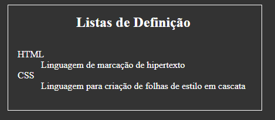

# Listas HTML: Organizando seu conteúdo

As listas HTML são elementos essenciais para apresentar informações de forma estruturada e hierarquizada em uma página web. Elas permitem organizar itens em sequências lógicas, facilitando a leitura e a compreensão do conteúdo.

#### Existem três tipos principais de listas HTML:

## 1. Listas ordenadas (OL)

- **Uso**: Empregadas quando a ordem dos itens é importante, como em passos de uma receita ou etapas de um processo.
- Marcador: Numeração automática (1, 2, 3, ... ).

- **Exemplo**:

```
<ol>
  <li>Primeiro item</li>
  <li>Segundo item</li>
  <li>Terceiro item</li>
</ol>
```

## 2. Listas Não Ordenadas (UL)

- **Uso**: Utilizado quando a ordem dos itens não é relevante, como em uma lista de compras ou características de um produto.
- **Marcador**: Símbolos como bolinhas, quadrados ou círculos.

- **Exemplo**:

```
<ul>
  <li>Maçã</li>
  <li>Banana</li>
  <li>Laranja</li>
</ul>
```

### Listas Aninhadas

As listas aninhadas permitem criar estruturas hierárquicas, inserindo uma lista dentro de outra. Isso é útil para organizar informações complexas de forma mais visual e intuitiva. Por exemplo, você pode criar uma lista de tarefas com subtarefas.

```
<h2>Listas Aninhadas</h2>

<ul>
    <li>Item 1</li>
    <li>Item 2
        <ul>
            <li>Item 2.1</li>
            <li>Item 2.2</li>
        </ul>
    </li>
    <li>Item 3</li>
</ul>
```


## 3. Listas de Definição (DL)

- **Uso**: Empregadas para apresentar termos e suas respectivas definições, como em um glossário ou dicionário.
- **Estrutura**: Cada item da lista é composto por um termo (DT) e sua definição (DD).

- **Exemplo**:

```
<h2>Listas de Definição</h2>

<dl>
    <dt>HTML</dt>
    <dd>Linguagem de marcação de hipertexto</dd>

    <dt>CSS</dt>
    <dd>Linguagem para criação de folhas de estilo em cascata</dd>
</dl>
```


- `<dl>`: Defina uma lista de descrição.
  - Envolve um grupo de termos (definidos por `<dt>`) e suas normas correspondentes (definidas por `<dd>`).


- `<dt>`: Defina um termo em uma lista de descrição.
  - Deve ser usado dentro de um elemento `<dl>`para especificar um termo.

- `<dd>`: Defina uma descrição de um termo em uma lista de descrição.
  - Deve ser usado dentro de um elemento `<dl>`para fornecer a descrição do termo definido pelo elemento `<dt>`anterior.

### [Menu - Listas, Tabelas, Details e popover](menu.md)

