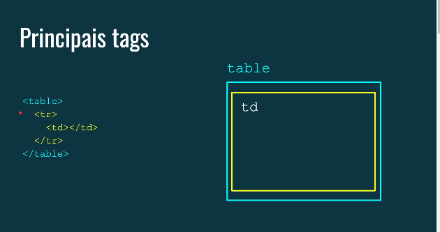
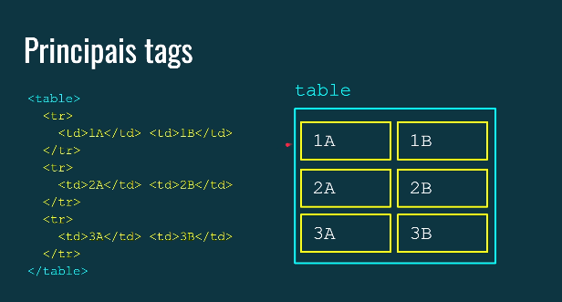
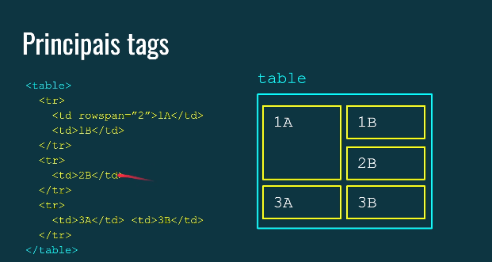
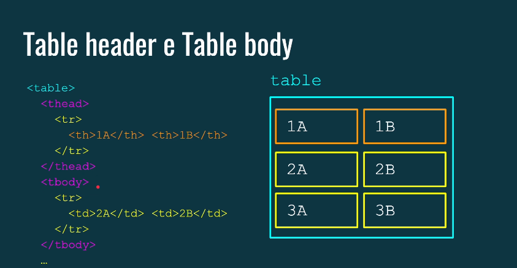
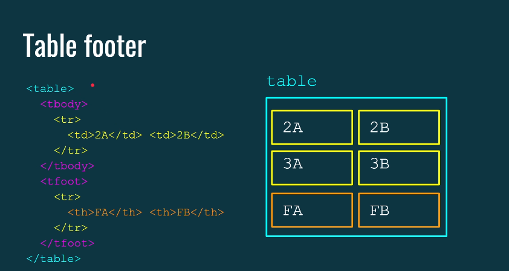
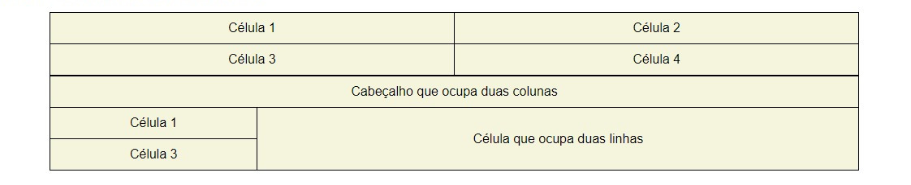
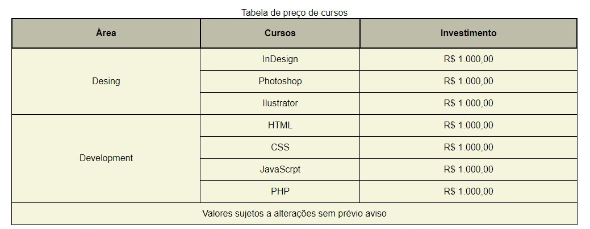
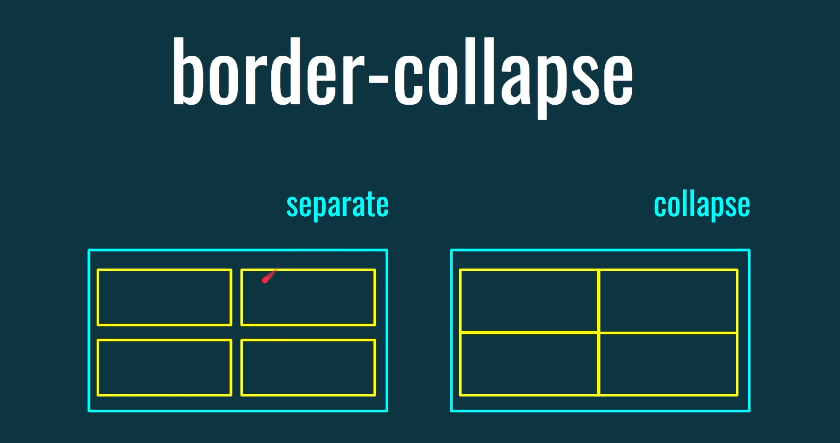

# Tabelas em HTML: Organizando dados em formato tabular

**Tabelas HTML** são elementos utilizados para apresentar dados em formato tabular, ou seja, em linhas e colunas. Eles são ideais para organizar informações de forma clara e concisa, facilitando a leitura e comparação de dados.

### As tags básicas das tabelas



- `<table>`: Define uma tabela em si. É uma tag pai de todas as outras tags relacionadas às tabelas.**
- **`<tr>` table row(linha)**: Define uma linha dentro da tabela.
- **`<td>` table data(coluna)**: Define uma célula dentro de uma linha. Cada célula contém um dado específico.

### Exemplo básico:



## Atributos colspan e rowspan

- **colspan**: Permite que uma célula ocupe mais de uma coluna.
- **rowspan**: Permite que uma célula ocupe mais de uma linha.



### Exemplo:

```
<table>
  <tr>
    <td colspan="2">Cabeçalho que ocupa duas colunas</td>
  </tr>
  <tr>
    <td>Célula 1</td>
    <td rowspan="2">Célula que ocupa duas linhas</td>
  </tr>
  <tr>
    <td>Célula 3</td>
  </tr>
</table>
```

## Tags para semânticas

- `<caption>`: Define um título para a tabela.
- `<th>`: Define uma célula de cabeçalho. Geralmente, as células do cabeçalho são formatadas de forma diferente das células de dados.
- `<thead>`: Agrupa as linhas do cabeçalho da tabela.
- `<tbody>`: Agrupa as linhas do corpo da tabela.
- `<tfoot>`: Agrupa as linhas de rodapé da tabela.




### Exemplo:

```
<table>
  <thead>
    <tr>
      <th>Nome</th>
      <th>Idade</th>
      <th>Cidade</th>
    </tr>
  </thead>
  <tbody>
    <tr>
      <td>João</td>
      <td>30</td>
      <td>São Paulo</td>
    </tr>
    <tr>
      <td>Maria</td>
      <td>25</td>
      <td>Rio de Janeiro</td>
    </tr>
  </tbody>   

  <tfoot>
    <tr>
      <td colspan="3">Total de registros: 2</td>
    </tr>
  </tfoot>
</table>
```



### Tabela avançada

```
HTML

<table>
    <caption>Tabela de preços de cursos</caption>

    <thead>
        <tr>
            <th>Área</th>
            <th>Curso</th>
            <th>Investimento</th>
        </tr>
    </thead>

    <tbody>
        <tr>
            <td rowspan="3">Desing</td>
            <td>InDesing</td>
            <td>R$ 1.000,00</td>
        </tr>
        <tr>
            <td>Photoshop</td>
            <td>R$ 1.000,00</td>
        </tr>
        <tr>
            <td>Ilustrator</td>
            <td>R$ 1.000,00</td>
        </tr>
        <tr>
            <td rowspan="4">Development</td>
            <td>HTML</td>
            <td>R$ 1.000,00</td>
        </tr>
        <tr>
            <td>CSS</td>
            <td>R$ 1.000,00</td>
        </tr>
        <tr>
            <td>JavaScript</td>
            <td>R$ 1.000,00</td>
        </tr>
        <tr>
            <td>PHP</td>
            <td>R$ 1.000,00</td>
        </tr>
    </tbody>
    <tfoot>
        <tr>
            <td colspan="3">
                Valores sujeitos a alteração sem prévi aviso 
            </td>
        </tr>
    </tfoot>
</table>
```

```
CSS

body {
  font-family: sans-serif;
}

table {
  width: 80%;
  margin: auto;
  background-color: beige;
  border-collapse: collapse;
}

th {
  background-color: rgb(189, 189, 169);
  border: 2px solid black;
  padding: 16px;
}

td {
  border: 1px solid black;
  text-align: center;
  padding: 10px;
}

tfoot tr td {
  text-align: center;
}
```



## Propriedade CSS `border-collapse`

Essa propriedade CSS controla como as bordas das células da tabela são renderizadas. Seus valores mais comuns são:

- **separado**: Cada célula tem sua própria borda.
- **colapso**: As bordas das células adjacentes são mescladas em uma única borda.



### Exemplo:

```
table {
  border-collapse: collapse;
}
```

### [Menu - Listas, Tabelas, Details e popover](menu.md)