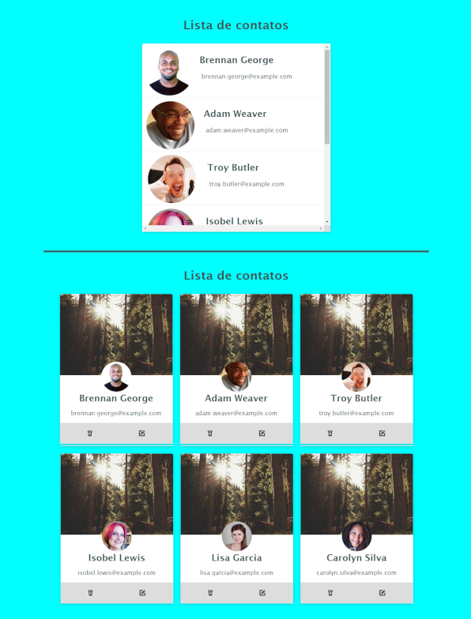

# Projeto 02

Projetos focados no treinamento de **Flexbox**, mas colocando em prática outros conhecimentos adiquiridos com o treinamento.

<h2> 🚀 Tecnologias</h2>

 
    
    

## HTML

- [Código HTML](index.html)

## CSS

- [Código CSS](style.css)

### [Menu HTML/CSS](../readme-HTML.md)