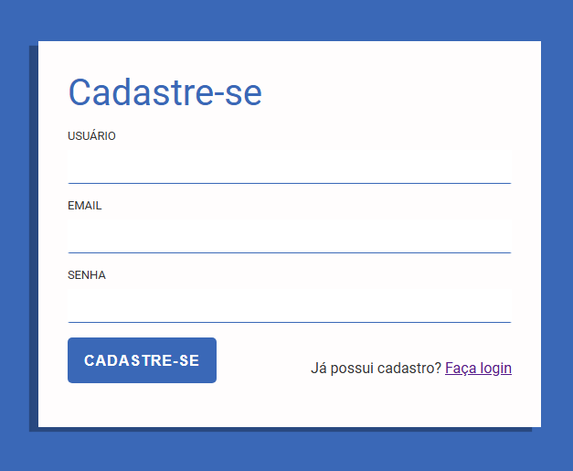
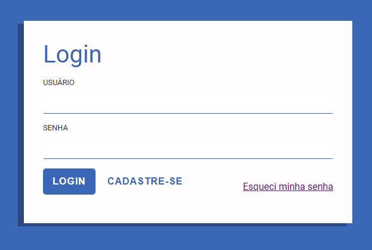
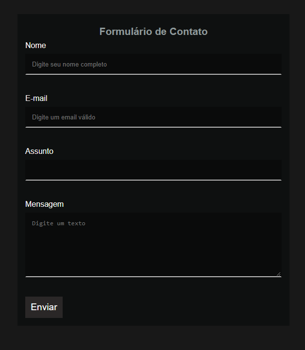

# Projeto Formulários de Contato 

Projetos desenvolvidos no treinamento sobre formulários.

<h2> 🚀 Tecnologias</h2>

 
    
    

- ### [Pseudo-Classes :focus, :invalid e :valid](pseudo-classes.md)

### [Menu HTML - CSS](../readme-HTML.md)