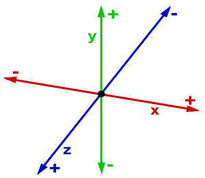

# Transformações 3D

## O que é o 3D?

### Sensação de profundade através do eixo Z

- Refere-se a uma simulação de profundidade nos objetos. A tridimensionalidade refere-se a uma representação de objetos que possuem 3 dimensões:
    - Largura;
    - Altura:
    - Profundidade;

Num ambiente 2D, por exemplo, trabalha-se apenas altura (**eixo Y**) e largura (**eixo X**), num ambiente 3D passa-se também a trabalhar com o **eixo Z**, que dará a sensação de profundidade.

# [Voltar ao Menu HTML/CSS](../readme-HTML.md)

- ### [perspective](perspective.md)

- ### [backface-viibility](backface-visibility.md)

- ### [preseve-3D](preserve-3d.md)

- ### [A Ordem Importa](ordem-importa.md)

- ### [Rotacionar Cartas](rotacionar-cards.md)
