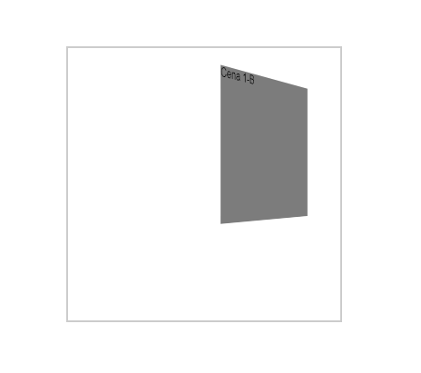
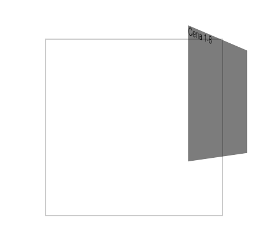

# A Ordem Importa

Assim como nas transformações 2D, a ordem de transformação, os valores que estão sendo utilizados dentro do `transform`, terão resultados diferentes, dependo da ordem que são aplicados.

Dado o código:

```
.cena1-a {
    transform: rotateY(45deg) translateX(200px);
    transform-style: preserve-3d;
}
```

Temos o seguinte resultado:



Porém, se ordem das propriedades forem invertidas no `transform`, segue o seguinte o resultado:

```
.cena1-a {
    transform: translateX(200px) rotateY(45deg);
    transform-style: preserve-3d;
}
```



São mesmas propriedades, mas com a ordem invertidas.

### [Menu Transformações 3D](introducao-menu.md)