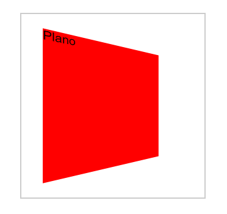
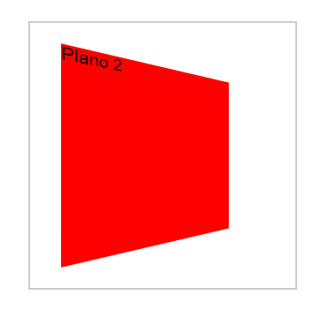
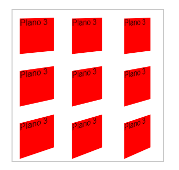
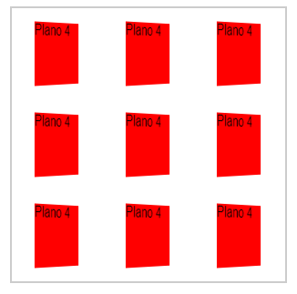

# Perspective

## O que é a propriedade `perspective`?

A propriedade `perspective` no CSS é uma ferramenta fundamental para simular a sensação de profundidade em elementos que, por natureza, são bidimensionais. Ela cria a ilusão de que os elementos estão em um espaço tridimensional, tornando suas interfaces mais dinâmicas e visuais.

### Como funciona?

Imagine que você está olhando para uma tela de computador. A propriedade `perspective` define a distância entre você (o observador) e essa tela. Quanto maior o valor atribuído a essa propriedade, mais distante você estará da tela e maior será o efeito de profundidade que você perceberá.

### Para que serve?

- **Crie efeitos 3D**: Botões com efeito de profundidade, cartões que se viram, menus que se abrem em 3D, etc.
- **Realismo simulado**: Dar a impressão de que os elementos saem da tela.
- **Melhorar a experiência do usuário**: Tornar as interfaces mais interativas e visuais.

### Conceitos importantes:

- **Contêiner de perspectiva**: A propriedade `perspective` é geralmente aplicada a um elemento pai (contêiner) e não aos elementos filhos diretamente. Isso cria um espaço 3D dentro de quais elementos filhos podem ser manipulados.
- **Transformações 3D**: Para criar a ilusão de profundidade, utilizamos as propriedades de transformação 3D, como `translateZ`, `rotateX` e `rotateY`.

### Exemplo prático:

```
HTML

<div class="cena" id="cena1">
    <div class="plano">Plano</div>
</div>
```

```
.cena {
    border: 2px solid #ccc;
    width: 300px;
    aspect-ratio: 1;
    margin: 80px;
}
.plano {
    background-color: red;
}
#cena1 {
    perspective: 200px;
}
#cena1 .plano {
    width: 200px;
    margin: 50px;
    aspect-ratio: 1;
    transform: rotateY(25deg);
}
```



## `perspective()`

Outra possibilidade é colocar no proprio `transform` a função `perspective()`

```
#cena2 .plano {
    width: 200px;
    margin: 50px;
    aspect-ratio: 1;
    transform: perspective(200px) rotateY(25deg);
}
```



- Aparentemente temos o mesmo resultado.

### Qual a diferença?

- Aplicando o `perspective` no **elemento pai**, caso houvessem mais elementos no **elemento pai** eles iriam obedecer a `perpective` comum da cena.

- Quando se é a função `perspective()`, a `perspective` será a mesma em cada objeto.

```
#cena3 {
    perspective: 600px;
    perspective-origin: right top;
}
#cena3 .plano {
    transform: rotateY(45deg);
}
```



- `perspective-origin` define o ponto de origem da perspectiva dentro do elemento que possui a propriedade `perspective`. Em outras palavras, ela determina o ponto a partir da qual a perspectiva é calculada.

### Aplicando a `perpective` nos elementos da cena, de forma individual

```
#cena4 .plano {
    transform: perspective(600px) rotateY(45deg);
}
```



- No 1º exemplo, todos os elementos estão compartilhando a mesma `perspective`, **o mesmo ponto de vista**.
- No 2º exemplo, cada elemento tem a sua própria `perspective`, **o seu próprio ponto de vista**. Eles estão exatamente iguais.

### [Menu Transformações 3D](introducao-menu.md)