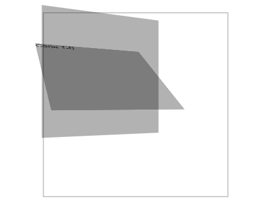

# O que é `preserve-3d`?

A propriedade CSS `preserve-3d`determina se os elementos filhos de um elemento devem ser renderizados em um espaço 3D. Em outras palavras, ela define se os elementos devem herdar a transformação 3D do elemento pai.

### Como funciona?

- **Espaço 3D**: Ao aplicar a propriedade `transform-style: preserve-3d` a um elemento, você cria um espaço 3D dentro desse elemento.
- **Elementos filhos**: Os elementos filhos desse elemento pai podem então ser transformados em 3D, utilizando propriedades como translateZ, `rotateX`, `rotateY` e `rotateZ`.
- **Herança de transformações**: As transformações 3D aplicadas aos elementos filhos serão compostas com a transformação 3D do elemento pai, criando efeitos 3D mais complexos.

### Exemplo:

```
#cena1 {
    perspective: 500px;
}
.cena1-a {
    transform: rotateY(25deg);
    transform-style: preserve-3d;
}
.cena1-b {
    transform: rotateX(55deg);
}
```



### Neste exemplo:

- O `id cena1`definiu um espaço 3D.
- O elemento `cena1-b`,que é um filho do `.cena1-a` é rotacionado em 55 graus em torno do eixo Y.Como o elemento pai possui `transform-style: preserve-3d` ,a rotação do card ocorre dentro do espaço 3D definido pelo elemento pai.

### Para que serve?

A propriedade `preserve-3d` é fundamental para criar efeitos 3D complexos e estruturas de elementos 3D.Ela é usada para:

- **Crie cubos e outras formas 3D**:Cada face do cubo pode ser um elemento com sua própria transformação 3D.
- **Criar animações 3D**:A propriedade `preserve-3d` permite criar animações suaves e complexas em 3D.
- **Construir interfaces 3D**:É possível criar interfaces de usuário com elementos que se movem e interagem em um espaço 3D.

### Observações:

- A propriedade `preserve-3d` deve ser aplicado ao elemento pai,não aos elementos infantis.
- O valor padrão de`transform-style` é `flat`,o que significa que os elementos filhos não herdam a transformação 3D do elemento pai.

### Em resumo:

A propriedade `preserve-3d` é essencial para trabalhar com elementos 3D em CSS.Ela permite criar efeitos visuais complexos e interativos,abrindo um mundo de possibilidades para o design de interfaces web.

### [Menu Transformações 3D](introducao-menu.md)