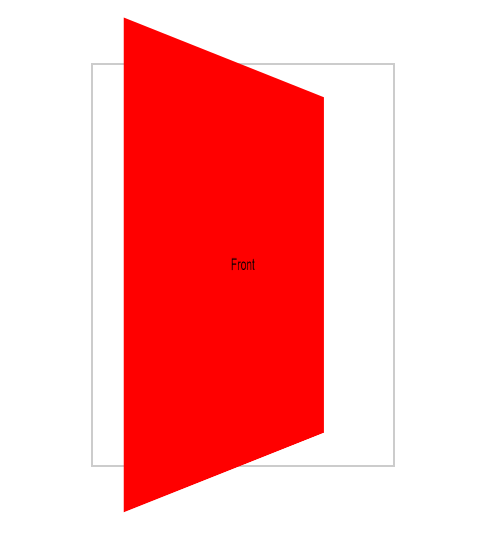
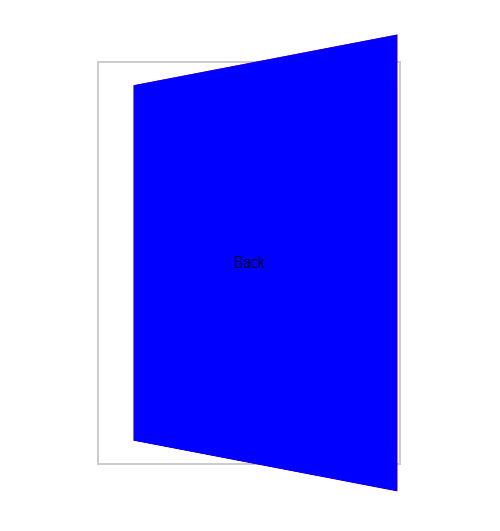

# Rotacionando Cards com CSS e transform-style

## Introdução

O CSS oferece ferramentas poderosas para criar efeitos visuais impressionantes, como a rotação de elementos. A propriedade `transform-style` é particularmente útil quando queremos criar efeitos de profundidade e rotação em elementos de um contêiner. Neste tutorial, vamos explorar como usar o `transform-style` para criar cartões com frente e verso que podem ser rotacionados.

### Criando a Estrutura HTML

```
<div class="card-container">
  <div class="card">
    <div class="card-face card-front">Frente do card</div>
    <div class="card-face card-back">Verso do card</div>
  </div>
</div>
```

- **card-container**: Contém o cartão.
- **card**: É o card em si, com as duas faces.
- **card-face**: Representa cada face do card.

### Estilizando com CSS

```
 .card-container {
    border: 2px solid #ccc;
    width: 300px;
    height: 400px;
    margin: 600px;
    perspective: 600px;
}
.card {
    width: 100%;
    height: 100%;
    transform-style: preserve-3d;
    transform: rotateY(125deg);
}

.card-face {
    position: absolute;
    width: 100%;
    height: 100%;
    display: flex;
    justify-content: center;
    align-items: center;
}
.card-face_front {
    background-color: red;
}
.card-face_back {
    background-color: blue;
    transform: rotateY(180deg);
    backface-visibility: hidden;
}
```

## Explicando o Código

- **perspectiva**: Defina a distância do observador do elemento 3D. Um valor maior cria um efeito mais profundo.
- **transform-style**: preserve-3d: Faz com que os filhos do elemento se comportam como elementos 3D, permitindo rotações em torno dos eixos X, Y e Z.
- **backface-visibility: hidden**: Esconde a face de trás do cartão quando não está na frente, evitando que ela seja vista através da face da frente.
- **transição**: Adicionada uma transição suave à propriedade transform, criando um efeito de rotação mais natural.
- **transform: rotateY(180deg);**: Rotaciona a face de trás 180 graus em torno do eixo Y, colocando-a no verso do cartão.
    - **É nessa propriedade que vamos definir se a visualização do `card` será frente ou verso.**

## Código mostrando frente e verso do `card`

### Frente

```
.card {
     transform: rotateY(50deg);
}
```


### Verso

```
.card {
     transform: rotateY(50deg);
}
```



### Personalizando e Expandindo

- **Rotações angulares**: Altere o valor do ângulo transform: rotateY()para controlar a quantidade de rotações.
- **Animações**: Use animações CSS ou JavaScript para criar animações mais complexas, como rotações contínuas ou efeitos de flip.
- **Cartões múltiplos**: Crie vários cartões e posições de forma interessantes para criar layouts mais dinâmicos.
- **Eventos**: Use eventos como clickou mouseoverpara controlar a rotação dos cartões de forma interativa.

### Criando mecanismo para o `card` rotacionacionar

```
.card-container:hover .card {
    transform: rotateY(180deg);
}
```

- Acrescentando `transition: 1.5s transform;` no `.card {}`.

### [Menu Transformações 3D](introducao-menu.md)