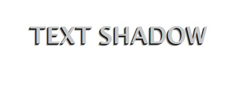

# Adicionando profundidade e estilo ao seu texto

### O que é text-shadow?

A propriedade text-shadowno CSS permite adicionar sombras ao seu texto, criando efeitos visuais interessantes e destacando palavras ou frases importantes. É uma ferramenta poderosa para personalizar a aparência do seu conteúdo e torná-lo mais atraente.

*** Como funciona:

- **Sintaxe**:


```
text-shadow: horizontal vertical blur color;
```
- **horizontal e vertical**: Definem a posição horizontal e vertical da sombra em relação ao texto.
- **desfoque**: Define o raio do desfoque da sombra.
- **cor**: Defina um cor da sombra.

#### Exemplo:

```
HTML

<p>Este texto tem uma sombra.</p>
```

```
CSS

p {
  text-shadow: 2px 2px 4px rgba(0, 0, 0, 0.5);
}
```
Neste exemplo, o texto terá uma sombra levemente desfocada e cinza, projetada 2 pixels para a direita e 2 pixels para baixo.

#### Várias sombras:

Assim como o `box-shadow`, você pode adicionar múltiplas sombras ao texto separando-as por vírgulas:

```
text-shadow: 2px 2px 4px rgba(0, 0, 0, 0.5), -1px -1px 2px rgba(255, 255, 255, 0.2);
```

```
h1 {
            font-family: 'Lucida Sans', sans-serif;
            text-align: center;
            margin-top: 100px;
            text-transform: uppercase;
            font-weight: bold;
            font-size: 3em;
            color: rgb(199, 199, 199);

            text-shadow: -1px 1px 0 rgba(0, 0, 0, .9),
            -2px 2px 0 rgba(0, 0, 0, .7),
            -3px 3px 0 rgba(0, 0, 0, .5),
            -4px 4px 0 rgba(0, 0, 0, .3),
            -5px 5px 0 rgba(0, 0, 0, .1);
        }
```

### Resultado final



### Aplicações:

- **Títulos**: Destacar títulos com sombras para chamar a atenção.
- **Citação**: Criar um efeito de citação com uma sombra leve.
- **Botões**: Adicionar profundidade e estilo a botões com texto.
- **Efeitos especiais**: Criar efeitos de néon ou texto em relevância.

### [Voltar ao Menu Avançando em CSS](menu.md)
