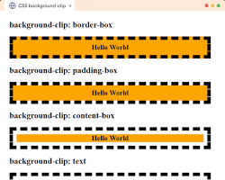

# A Propriedade CSS `background-clip` 

A propriedade `background-clip` em CSS define **até onde o plano de fundo de um elemento se estende** . Em outras palavras, ela determina se o fundo (seja uma cor sólida ou uma imagem) vai se estender por baixo da borda, do preenchimento ou apenas do conteúdo do elemento.

### Em resumo:

- **Borda**: O fundo se estende até a borda do elemento.
- **Preenchimento**: O fundo se estende até o preenchimento do elemento.
- **Conteúdo**: O fundo se estende apenas até o conteúdo do elemento.

### Valores comuns:

- **border-box**: O fundo se estende até a borda do elemento.
- **padding-box**: O fundo se estende até o preenchimento do elemento.
- **content-box**: O fundo se estende apenas até o conteúdo do elemento.

### Exemplo:

```
div {
  background-color: lightblue;
  border: 5px solid blue;
  padding: 10px;
}

/* Para o fundo se estender até a borda: */
div {
  background-clip: border-box;
}

/* Para o fundo se estender até o preenchimento: */
div {
  background-clip: padding-box;
}

/* Para o fundo se estender apenas até o conteúdo: */
div {
  background-clip: content-box;
}
```

### Visualizando o efeito:



### Quando usar:

- **Criar efeitos visuais**: Combinado com outras propriedades CSS, como `border-radius`e `box-shadow`, pode criar efeitos visuais interessantes.
- **Controlar a aparência dos elementos**: Ao definir o `background-clip`, você pode controlar como o fundo interage com os outros elementos da página.

### Observações:

- A propriedade `background-clip`faz parte do CSS3 e é amplamente suportada pelos navegadores modernos.
- Para um controle mais preciso, você pode combinar `background-clip`outras propriedades relacionadas ao fundo, como `background-origin`e `background-size`.

### Em resumo:

A propriedade `background-clip`é uma ferramenta poderosa para personalizar a aparência de seus elementos HTML. Ao entender como ela funciona, você pode criar designs mais sofisticados e personalizados.


### [Menu cores e efeitos](menu_cores-efeitos.md)