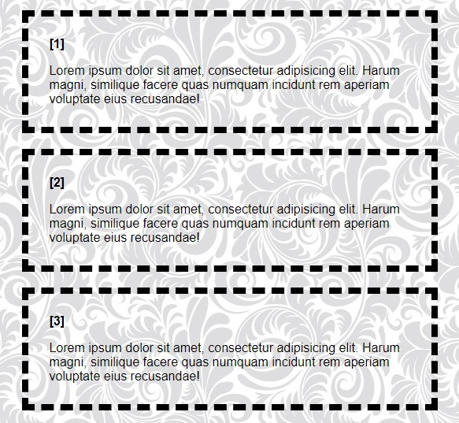

# Como criar contadores via CSS

A tag `counter` é uma propriedade CSS que permite criar e manipular contadores em elementos HTML. Ela é frequentemente usada para criar numerações automáticas, como listas numeradas ou páginas de um documento.

## Como funciona:

### 1. Definição do contador:

- Você define um contador usando a propriedade `counter-reset` em um elemento pai. Isso cria um novo contador com um valor inicial.
- **Por exemplo**: numa `section`, que é o elemento pai de algumas `div`: `counter-reset: contador;`
  - **Definir o elemento a ser incrementado o contador**: `div .cores` { `counter-increment: contador;`}


### 2. Aplicação do contador:

- A propriedade `counter()` é usada para inserir o valor atual do contador em um elemento.

- **Por exemplo**: insira o valor do contador `"contador"` no conteúdo do elemento. `content: counter(contador)`;

### Exemplo:

```
HTML

<section>
        <div class="cores">
            <p>Lorem ipsum dolor sit amet, consectetur adipisicing elit. Harum magni, similique facere quas numquam
                incidunt rem aperiam voluptate eius recusandae!</p>
        </div>
        <div class="cores">
            <p>Lorem ipsum dolor sit amet, consectetur adipisicing elit. Harum magni, similique facere quas numquam
                incidunt rem aperiam voluptate eius recusandae!</p>
        </div>
        <div class="cores">
            <p>Lorem ipsum dolor sit amet, consectetur adipisicing elit. Harum magni, similique facere quas numquam
                incidunt rem aperiam voluptate eius recusandae!</p>
        </div>
</section>
```

```
CSS

section {
    counter-reset: contador;
}

.cores {
    counter-increment: contador;
}

.cores::before {
    content: "[" counter(contador) "]";
    font-weight: bold;
    display: inline-block;
    margin-bottom: 16px;
}
```



### [Menu Cores e efeitos](menu_cores-efeitos.md)