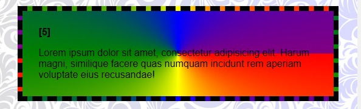

# Gradiente Cônico no CSS: Um Arco-Íris em Suas Mãos!

## O que é um gradiente cônico?

Imagine um círculo com núcleos que se misturam suavemente umas nas outras, como um arco-íris. Essa é a ideia por trás do gradiente cônico no CSS. Em vez de uma transição linear de núcleos (como em um gradiente linear) ou radial (como em um gradiente radial), o gradiente cônico cria um efeito circular, perfeito para criar elementos visuais sonoros e envolventes.

### Como funciona:

- **Ponto central**: O gradiente começa em um ponto central e se expande em um círculo completo.
- **Núcleos**: Você define como núcleos que desejam que apliquem no gradiente e a ordem em que elas se misturarão.
- **Ângulo**: O ângulo determina a direção em que os núcleos se espalham a partir do ponto central.

### Sintaxe básica:

```
background-image: conic-gradient(from angle, color1, color2, ...);
```

- `from angle`: Define o ângulo inicial do gradiente.
- `color1`, `color2`, ...: As cores que você deseja usar sem gradiente.

### Exemplo:

```
.cores:nth-of-type(5) {
    background-image: conic-gradient(from 90deg, red, yellow, green, blue, purple);
    
}
```




Esse código criará um círculo com um gradiente que começa no vermelho, se move para o amarelo, depois para o verde, azul e por fim, roxo. O ângulo de 45 graus define a direção inicial do gradiente.

### Para que serve?

Os gradientes cônicos são ideais para:

- **Crie botões e ícones personalizados**: Adicione um toque especial aos seus elementos interativos.
- **Desenhar gráficos e diagramas**: Visualize dados de forma mais atraente e intuitiva.
- **Crie efeitos visuais únicos**: experimente com diferentes ângulos e cores para obter resultados surpreendentes.

### Dica extra:

Você pode combinar gradientes cônicos com outras propriedades CSS para criar efeitos ainda mais complexos e personalizados. Por exemplo, adicione uma animação para criar um efeito de rotação ou use uma propriedade `mask`para criar formas personalizadas dentro do gradiente.


### [Menu cores e efeitos](menu_cores-efeitos.md)