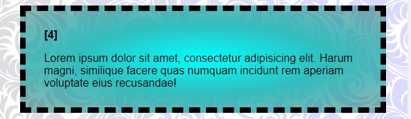

# Gradiente Radial em CSS: Criando Efeitos de Profundidade e Radiação

#### O gradiente radial em CSS cria um efeito visual de transição suave entre núcleos a partir de um ponto central, como se os núcleos se irradiassem para fora em um círculo ou elipse.

### Como funciona:

- **Ponto central**: A transição de núcleos começa a partir de um ponto específico dentro do elemento.
- **Forma**: A forma do gradiente pode ser circular ou elíptica.
- **Direção**: Os núcleos se espalham radialmente a partir do ponto central.

### Sintaxe:

```
background-image: radial-gradient(shape at position, color-stop1, color-stop2, ...);
```

- `shape`: Define a forma do gradiente (círculo ou elipse).
- `position`: Define a posição do ponto central (por exemplo, canto superior esquerdo, centro, canto inferior direito).
- `color-stop`: Defina como núcleos e suas respectivas posições no gradiente.

### Exemplo:

```
.cores:nth-of-type(4) {
    background-image: radial-gradient( #0ff,rgb(49, 190, 190), rgba(17, 105, 105, 0.486));
    
}
```



### Outras possibilidades:

- **Múltiplos pontos focais**: Combinar vários gradientes radiais para criar efeitos mais complexos.
- **Gradientes aninhados**: Utilize gradientes radiais dentro de outros gradientes para criar padrões intrincados.
- **Gradientes repetidos**: Criar padrões contínuos com a função repeating-radial-gradient().

### Em resumo:

O gradiente radial é uma ferramenta poderosa para criar efeitos visuais impactantes e personalizados em seus projetos web. Com ele, você pode simular profundidade, criar texturas e adicionar um toque de modernidade aos seus designs.


### [Menu cores e efeitos](menu_cores-efeitos.md)