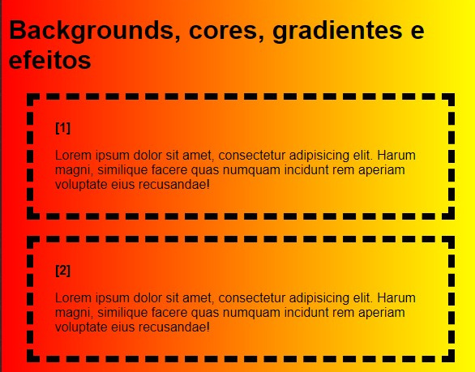
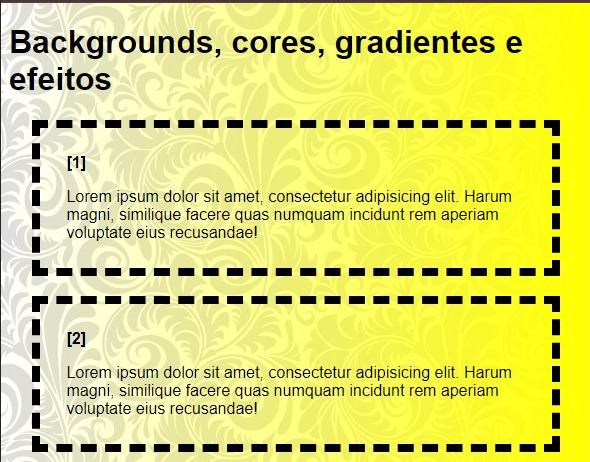
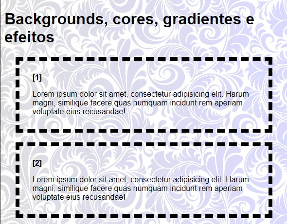

# linear-gradient, background-blend-mode e background-attachment

## linear-gradient

- **O que é**: Cria um gradiente linear, ou seja, uma transição suave entre dois ou mais núcleos em uma direção específica.
- **Como usar**:

```
background-image: linear-gradient(to right, red, yellow);
```



- **Definição**:

  - `to right`: Define a direção do gradiente (pode ser `to left`, `to top`, `to bottom`, ou um `ângulo`).
  - `red`, `yellow`: As cores de início e fim do gradiente.
- **Modos**:
  - `Múltiplos gradientes`: Pode-se combinar vários gradientes em um mesmo elemento.
  - **Paradas de cor**: Adicione mais núcleos e defina pontos específicos onde as transições ocorrerão.
  - **Funções de núcleos**: Utilização de funções como `rgb()`, `hsl()`, `rgba()`, `hsla()` para definir núcleos mais precisos.


## background-attachment

- **O que é**: Defina como o plano de fundo se comporta em relação ao conteúdo de um elemento quando rolamos uma página.
- **Como usar**:

```
background-image: linear-gradient(to right, transparent, yellow), url(img/image/tile.png);
background-attachment: fixed; 
```



- **Definições**

  - `fixed`: O fundo permanece fixo enquanto o conteúdo rola.
- **Modos**:
  - `fixed`: Ideal para criar efeitos de paralaxe ou manter um elemento em destaque.
  - `scroll`: O background rola junto com o conteúdo (padrão).
  - `local`: O fundo se repete localmente dentro do elemento, independentemente do rolamento.


## background-blend-mode

- **O que é**: Combina múltiplos fundos (imagens, gradientes, núcleos sólidos) de diferentes maneiras.
- **Como usar**:

```
 background-image: linear-gradient(to right, transparent, blue), url(img/image/tile.png);
 background-attachment: fixed;
 background-blend-mode: color;  
```



- **Modos**:

  - `color`: Ira mesclar as duas imagens.
  - `screen`: Cria um efeito de sobreposição, como se os núcleos estivessem sendo projetados em uma tela.
  - `multiply`: Multiplica as cores, resultando em tons mais escuros.
  - `overlay`: Combina as características de `multiply`e `screen`, dependendo da base.
  - `darken`: Escolhe a cor mais escura em cada ponto.
  - `lighten`: Escolhe a cor mais clara em cada ponto.
  - **E muitos outros**: Cada modo cria um efeito visual distinto.

 ### [Menu cores e efeitos](menu_cores-efeitos.md)


