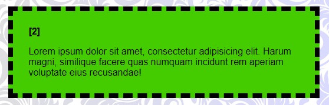
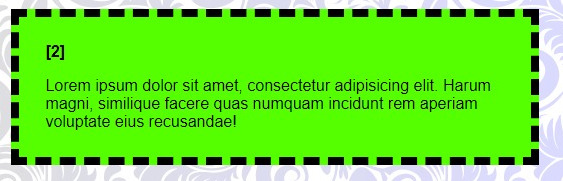

# O que é HSL?

**HSL** é um modelo de cor no espaço de núcleos cilíndrico, onde os núcleos são representados por três componentes:

- **Hue** (matiz): Representa a cor dominante, medida em graus (de 0 a 360). Por exemplo, 0 é vermelho, 120 é verde e 240 é azul.
- **Saturation** (saturação): Representa a pureza da cor, medida em percentagem (de 0 a 100). 0 é cinza e 100 é a cor mais pura.
- **Lightness** (luminosidade): Representa a quantidade de luz na cor, medida em porcentagem (de 0 a 100). 0 é preto, 50 é o meio-tom e 100 é branco.

### Como usar HSL no CSS

Para usar HSL no CSS, você escreve a seguinte sintaxe:

```
hsl(hue, saturation, lightness);
```

### Por exemplo:

```
color: hsl(120deg, 50%, 70%);
```

Isso definirá o cor como um verde claro.

### Vantagens de usar HSL

- **Intuição**: É mais intuitivo selecionar uma cor baseada em matiz, saturação e luminosidade do que em valores RGB ou hexadecimal.
- **Facilidade de ajuste**: É fácil ajustar para ajustar um dos componentes. Por exemplo, para tornar a cor mais clara, basta aumentar o valor de luminosidade.
- **Harmonia de cores**: HSL pode ser útil para criar paletas de cores harmoniosas, pois é mais fácil visualizar as relações entre as cores.

### Exemplo de paleta de cores usando HSL:

```
.cores:nth-of-type(2) {
    background-color: hsl(100deg, 100%, 40%);
    cursor: pointer;
}
```



```
.cores:nth-of-type(2):hover {
    background-color: hsl(100deg, 100%, 50%);
}
```




### [Menu cores e efeitos](menu_cores-efeitos.md)