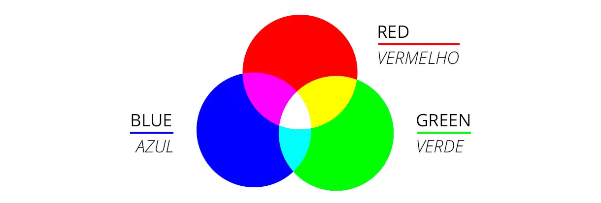
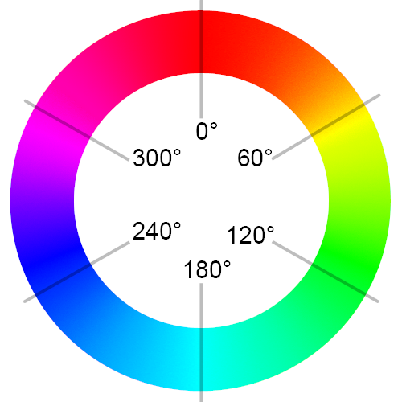

# Cores no CSS: RGB, HSL e Mais!

As cores são elementos essenciais para criar designs atraentes e transmitir emoções. O CSS nos oferece diversas maneiras de definir núcleos, e hoje vamos explorar os modelos RGB, HSL e os núcleos definidos por ângulos e alfa.

### Por que é importante entender sobre núcleos no CSS?

- **Personalização**: As cores permitem que você crie designs únicos e personalizados.
- **Expressão**: As cores transmitem emoções e sensações, ajudando a contar uma história.
- **Acessibilidade**: A escolha correta das cores é fundamental para garantir que seus designs sejam acessíveis a todos os usuários.
## Modelos de Cores no CSS

### 1. RGB (Vermelho, Verde, Azul)



- **Conceito**: O modelo RGB combina diferentes intensidades de vermelho, verde e azul para criar uma ampla gama de núcleos.
  - A **Soma** de todas as cores será o branco
  - **Todas** a cores desligadas será preto(*ausência de luz*)
- **Sintaxe**:
  - `rgb(red, green, blue)`: Cada valor varia de 0 a 255.
  - `rgba(red, green, blue, alpha)`: Inclui um quarto valor, que controla a transparência (0 é totalmente transparente, 1 é totalmente opaco). alpha
- **Exemplo**:

```
color: rgb(255, 0, 0); /* Vermelho puro */
background-color: rgba(0, 255, 0, 0.5); /* Verde com 50% de transparência */
```

## 2. HSL (Matiz, Saturação, Luminosidade)


- **Conceito**: O modelo HSL descreve como cores em termos de matiz (tom), saturação (intensidade da cor) e luminosidade.
- **Sintaxe**:
  - `hsl(hue, saturation, lightness)`:
     - `hue`: Ângulo em graus (0-360) que representa a tonalidade da cor.
     - `saturation`: Porcentagem (0-100%) que indica a intensidade da cor.
     - `lightness`: Porcentagem (0-100%) que define a luminosidade da cor.
  - `hsla(hue, saturation, lightness, alpha)`: Semelhante ao RGBA, adicione a propriedade `alpha` para controlar a transparência.
- **Exemplo**:

```
color: hsl(120, 100%, 50%); /* Verde claro */
background-color: hsla(0, 100%, 50%, 0.8); /* Vermelho com 80% de transparência */
```

## 3. Núcleos Definidos por Ângulos e Alfa



- **Conceito**: Algumas propriedades CSS, como `rotate`, permitem definir valores em graus para criar efeitos de rotação. O valor `alpha` é utilizado para controlar a opacidade.
- **Exemplo**:

```
transform: rotate(45deg); /* Rotaciona o elemento 45 graus */
opacity: 0.5; /* Define a opacidade em 50% */
```

## 4. O Atributo Alpha: Criando Transparência em seus Cores

O atributo **alfa** é um componente fundamental no CSS, responsável por controlar a **transparência** de um cor. Ele nos permite criar efeitos visuais como sombras suaves, sobreposições delicadas e elementos que se misturam com o fundo.

### Como o alpha funciona:

- **Escala**: O valor de alfa varia entre 0 (totalmente transparente) e 1 (totalmente opaco). Valores intermediários criam diferentes níveis de opacidade.
- **Utilização**: O alfa é geralmente adicionado ao final de uma representação de cor, separado por uma vírgula.

### Representações de núcleos com alfa:

### 1. RGBA (Vermelho, Verde, Azul, Alfa):

  - Combine as intensidades de vermelho, verde e azul com um canal alfa para definir a opacidade.
  - **Sintaxe**: `rgba(red, green, blue, alpha)`
  - **Exemplo**: crie um vermelho com 50% de transparência. `rgba(255, 0, 0, 0.5)`

### 2. HSLA (matiz, saturação, luminosidade, alfa):

  - Semelhante ao RGBA, mas descreve a cor em termos de matiz, saturação e luminosidade, além do alfa.
  - **Sintaxe**: `hsla(hue, saturation, lightness, alpha)`
  - **Exemplo**: crie um verde claro com 80% de transparência. `hsla(120, 100%, 50%, 0.8)`

### 3. Hexadecimal com alfa:

- **RGBA em hexadecimal**: Embora não exista um formato hexadecimal nativo para o alfa, você pode simular a transparência usando o formato RGBA e convertendo os valores RGB para hexadecimal.
- **Exemplo**: equivale a (os dois últimos dígitos representam o canal alfa em hexadecimal). `rgba(255, 0, 0, 0.5)``#FF000080`

## Em resumo:

| **sem alpha** | **com alpha** |
|---------------|---------------|
|`#ff0000`  `#f00`| `#ff000077` `#f007`|
| `rgb(255, 0 0)`  `rgb(255 0 0)` | `rgb(255, 0, 0, .5)`  `rgb(255 0 0 /.5)` `rgba(255, 0, 0, .5)`|
|`hsl(0, 100%, 50%)` `hsl(0 100% 50%)`| `hsl(0, 100%, 50%, .5)` `hsl(0 100% 50% / .5)` `hsla(0, 100%, 50%, .5)`|

### Quando usar alpha:

- **Crie efeitos de sobreposição**: Crie camadas com diferentes níveis de opacidade para criar efeitos de profundidade e dimensão.
- **Crie sombras suaves**: Aplique uma sombra com um valor alfa baixo para obter um efeito mais suave e natural.
- **Misturar núcleos**: Crie transições suaves entre núcleos usando diferentes níveis de opacidade.
- **Criar elementos semitransparentes**: Use o alfa para criar elementos que permitam visualizar o conteúdo por trás deles.

### [Menu cores e efeitos](menu_cores-efeitos.md)

