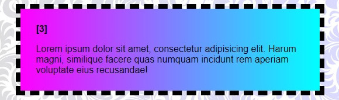

# Múltiplos Gradientes em CSS: Criando Efeitos Visuais Impactantes

O CSS permite que você combine diversos gradientes em um único elemento, abrindo um leque de possibilidades para criar designs personalizados e visuais complexos.

### Como funciona:

- **Empilhando gradientes**: Ao definir várias propriedades `background-image` com diferentes gradientes, eles são empilhados, um sobre o outro.
- **Criando profundidade**: Gradientes mais claros por cima de gradientes mais escuros podem simular profundidade e criar efeitos de luz e sombra.
- **Texturas**: A combinação de gradientes lineares e radiais permite simular diversas texturas, como madeira, mármore ou tecidos.
- **Efeitos visuais**: É possível criar efeitos de brilho, néon, degradantes suaves ou abruptos e muito mais.

Exemplo:

```
.cores:nth-of-type(3) {
    background-image:
    linear-gradient(to right, #f0f, #0ff),
    radial-gradient(circle at top left, #fff, transparent);
    background-clip: padding-box; 
}
```



Neste exemplo, um gradiente linear horizontal de rosa para azul é sobreposto por um gradiente radial que cria um efeito de luz vindo do canto superior esquerdo.

### Aplicações:

- **Fundo de páginas**: Crie fundos sonoros e personalizados para seus sites.
- **Botões e cartões**: Destaque elementos com gradientes suaves ou vibrantes.
- **Cabeçalhos e rodapés**: Crie transições suaves entre frascos.
- **Elementos decorativos**: Adicione um toque especial a elementos como divisores e caixas.

### Considerações:

- **Desempenho**: O uso excessivo de gradientes pode impactar o desempenho da página. Utilize-os com moderação e otimize o código.
- **Compatibilidade**: Gradientes são amplamente suportados em navegadores modernos, mas é sempre bom verificar a compatibilidade com navegadores mais antigos.
- **Criatividade**: A combinação de gradientes é uma arte. Experimente diferentes cores, ângulos e tipos de gradiente para criar designs únicos.

#### Em resumo:

Múltiplos gradientes em CSS são uma ferramenta poderosa para criar designs visuais personalizados e impactantes. Com um pouco de criatividade, você pode transformar seus projetos web em algo realmente especial.


### [Menu cores e efeitos](menu_cores-efeitos.md)