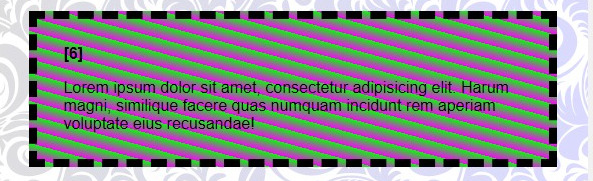
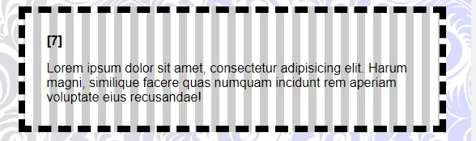
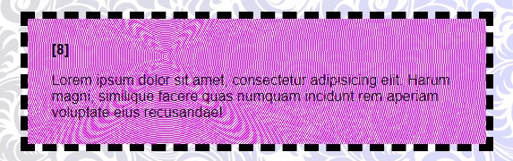

# Repetindo Padrões Visuais

A propriedade `repeating` em gradientes CSS é uma ferramenta poderosa para criar padrões visuais complexos e personalizados de forma eficiente. Ela permite que você repita um gradiente linear ou radial ao longo de um eixo específico, criando efeitos visuais interessantes e únicos.

### Como funciona?

Ao adicionar a palavra-chave `repeating` antes da função `linear-gradient` ou `radial-gradient`, você instrui o navegador a repetir o gradiente ao longo do eixo especificado.

### Exemplo:

```
.cores:nth-of-type(6) {
    background-image: repeating-linear-gradient(to top right, #f0f 0%, #0f0 5%);
}
```



- `repeating-linear-gradient`: Indica que queremos um gradiente linear que se repete.
- `to top right`: Define a direção do gradiente.
- ` #f0f 0%, #0f0 5%`: Especifica as cores e seus pontos de parada.

## Tipos de Gradientes Repetidos

- `repeating-linear-gradient`: Repete um gradiente linear ao longo de uma linha reta.
- `repeating-radial-gradient`: Repete um gradiente radial a partir de um ponto central.

### Personalizando o Padrão

Você pode personalizar o padrão de reprodução ajustando as seguintes configurações:

- **Direção**: Altere o ângulo para modificar a direção do gradiente.
- **Núcleos**: Experimente diferentes combinações de núcleos para criar efeitos visuais distintos.
- **Pontos de parada**: Ajuste os pontos de parada para controlar a largura e o espaçamento das faixas de cor.
- **Tamanho do elemento**: O tamanho do elemento que contém o gradiente também influencia a aparência do padrão.

### Exemplos Práticos

- ### Criação de um fundo listrado:

```
background: repeating-linear-gradient(90deg, #fff, #fff 10px, #ccc 10px, #ccc 20px);
```



- ### Simulação de um tecido:

```
background: repeating-radial-gradient(circle at 30% 30%, #f0f, #f0f 1px, transparent 1px, transparent 2px);
```




### Onde usar?

- **Fundo de páginas**: Crie fundos personalizados e chamativos.
- **Elementos de design**: Use para criar botões, cartões e outros elementos com um visual único.
- **Efeitos visuais**: Simule texturas, padrões e outros efeitos visuais.

### Dicas Adicionais

- **Combine com outras propriedades CSS**: Use background-size, e outras propriedades para ajustar a aparência do padrão. background-position
- **Explore diferentes navegadores**: A renderização de gradientes pode variar entre navegadores, então teste em diferentes plataformas.
- **Utilize ferramentas de criação de gradientes**: Existem ferramentas online que podem te ajudar a visualizar e criar gradientes personalizados.


### [Menu cores e efeitos](menu_cores-efeitos.md)