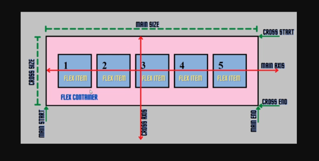
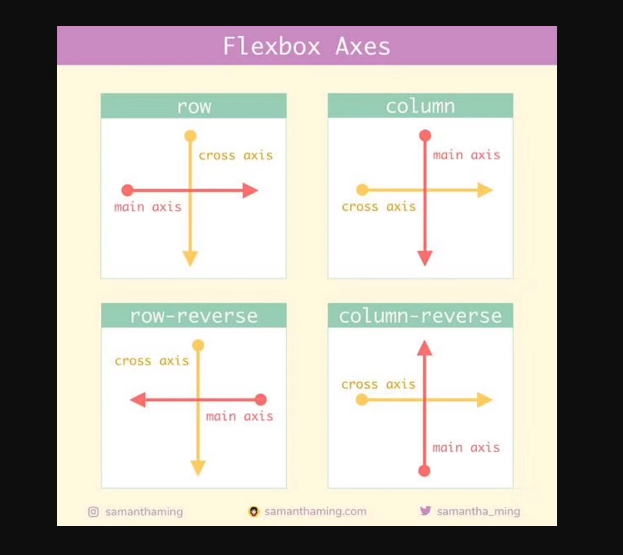

# Cross-Axiss e Main-Axis

Sempre que trabalhamos com Flexbox temos um **flex-container** e ele vai afetar os elementos filhos **flex-itens**.

### Mas temos algumas terminologias:

- **main-size**: Refere-se à dimensão (largura ou altura) do contêiner flexível ao longo do **main axis** (eixo principal). Esta é a dimensão principal ao longo da qual os itens são dispostos.

- **main-start**: O ponto inicial ao longo do **main axis**. É onde os itens flexíveis começam a ser alinhados no contêiner.

- **main-end**: O ponto final ao longo do **main axis**. É onde os itens flexíveis terminam no contêiner.

- **main-axis**: O eixo principal ao longo do qual os itens flexíveis são dispostos. Por padrão, é horizontal (do left para right) se a direção do contêiner for row, e vertical (de cima para baixo) se a direção for column.

- **cross-axis**: O eixo perpendicular ao **main axis**. Se o eixo principal é horizontal (como na direção row), o eixo cruzado será vertical (de cima para baixo), e vice-versa.

- **cross-size**: Refere-se à dimensão do contêiner flexível ao longo do cross axis. É a dimensão que não é considerada como o main-size.

- **cross-start**: O ponto inicial ao longo do cross axis. É onde os itens flexíveis começam a ser alinhados transversalmente.

- **cross-end**: O ponto final ao longo do cross axis. É onde os itens flexíveis terminam transversalmente.

### Mas nem sempre isso é verdade

Os valores **main-axis** e **cross-axis** podem de acordo com a direção determinada pelo `flex-direction`:

Entender esses termos é crucial para um design de layout Flexbox eficaz. Ao entender os eixos principal e transversal, você pode controlar precisamente o alinhamento, o dimensionamento e a distribuição dos seus itens flex.

### [Menu Flexbox](menu-flexbox.md)