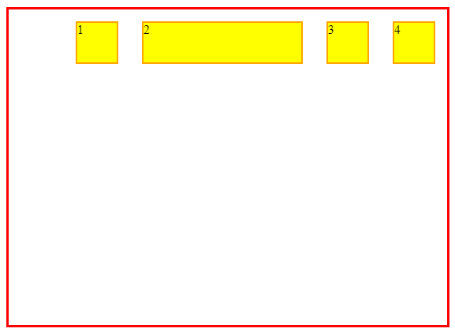
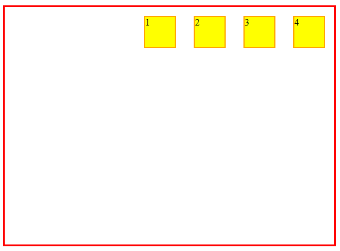

# flex-basis

## Flex-Base: Definindo o tamanho inicial de um Flex item

A propriedade `flex-basis` é usada para definir o tamanho principal inicial de um **flex item**. Ela define quanto espaço um item deve ocupar antes que qualquer espaço extra seja distribuído ou removido.

### Pontos-chave:

- **Tamanho inicial**: estabelece um tamanho base para o item.
- **Tamanho principal**: O tamanho principal é o tamanho ao longo do eixo principal do flex container. Este eixo é determinado pela propriedade `flex-direction`.
    - Para `flex-direction: row`, o tamanho principal é a largura.
    - Para `flex-direction: column`, o tamanho principal é a altura.
- **Unidades**: Você pode usar várias unidades para `flex-basis`, como pixels, porcentagens ou auto.

## Casos de uso comuns:

```
<div class="flexbox flex-container7">
    <div class="div1">1</div>
    <div class="div2">2</div>
    <div class="div3">3</div>
    <div class="div4">4</div>
</div>
```

### 1. Largura fixa:

```
.flex-container7 .div2 {
    flex-basis: 200px;
}
```



- Isso define uma largura fixa de 200 pixels para o item.
- O valor do `flex-basis`, prevalece quanto ao valor especificado no `width`.

### 2. Dimensionamento automático:

```
.flex-container7 div {
    background-color: yellow;
    width: 50px;
    height: 50px;
}
.flex-container7 .div2 {
    flex-basis: auto;
}
```



- A largura será determinada pelo `width` especificado.

### [Menu Flexbox](menu-flexbox.md)