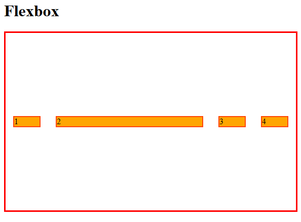
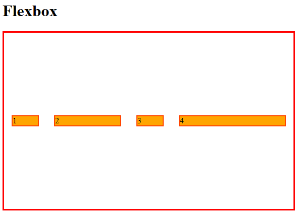
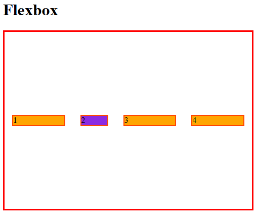

# Propriedades para elementos-filhos

A seguir, veremos propriedades que devem ser declaradas tendo como seletor os elementos-filhos, ou seja:

```
HTML

<body>
    <h1>Flexbox</h1>
    <div class="flexbox flex-container">
        <div class="div1">1</div>
        <div class="div2">2</div>
        <div class="div3">3</div>
        <div class="div4">4</div>
    </div> 
</body>
```

```
<style>
    body {
        margin-bottom: 250px;
    }
    .flexbox {
        height: 350px;
        border: 3px solid red;
        margin-bottom: 15px;
        display: flex;
    }
    .flexbox div {
        border: 2px solid orangered;
        margin: 15px;
    }
    .flex-container {
        justify-content: center;
        align-items: center;
    }
    .flex-container div {
        flex-basis: 50px;
        background-color: orange;
    }
</style>
```

Isso significa que, onde existe um elemento-pai com propriedade *flex* (o *flex-container*), é possível atribuir propriedades *flex* específicas também para as elementos-filhos (*flex-item*).

Você pode definir as propriedades abaixo para apenas um dos elementos-filhos através de um identificador, como uma classe específica.

## flex-grow


Define a habilidade de um flex item de crescer, caso necessário. O valor dessa propriedade é um valor numérico sem indicação de unidade, que serve para cálculo de proporção. Este valor dita a quantidade de espaço disponível no container que será ocupado pelo item.

Se todos os ítens tiverem flex-grow definido em 1, o espaço remanescente no container será distribuído de forma igual entre todos. Se um dos ítens tem o valor de 2, vai ocupar o dobro de espaço no container com relação aos outros (ou pelo menos vai tentar fazer isso).

- **Valores negativos não são aceitos pela propriedade.**
- **Valor padrão "0"**

### Exemplo:

```
.flex-container .div2 {
    flex-grow: 1;
}
```



- A `div` com classe `div2` ocupou todo o espaço restante que tinha no container.

```
.flex-container .div2 {
        flex-grow: 1; /*33,3333% 1/3*/
}
.flex-container .div4 {
    flex-grow: 2; /*66,6666% 2/3*/
}
```


- A `div4` ocupor 2/3 do tamanho em relação a `div2`

## flex-shrink

Define a habilidade de um flex item de encolher, caso necessário.

- **Valores negativos não são aceitos pela propriedade.**
- - **Valor padrão "1"**

### Exemplo:

```
.flex-container .div2 {
    background-color: blueviolet;
    flex-shrink: 2;
}
```


- O elemento com o `flex-shrink` maior vai diminuir proporcionalmente mais que outros elementos, até o limite do tamanho definido **no elemento**.

##  Shorthand "flex"

A abreviatura `flex`no Flexbox é uma propriedade poderosa que permite que você defina diversas propriedades relacionadas ao item flex em uma única declaração. Isso torna seu CSS mais conciso e fácil de ler.

### O que o `flex` faz?

A abreviatura `flex` combina as seguintes propriedades individuais:

- `flex-grow`: Defina como um item flexível se expande para preencher o espaço extra no container.
- `flex-shrink`: Defina como um item flexível e compacto se não houver espaço suficiente.
- `flex-basis`: Defina a largura inicial de um item flexível antes que ocorra crescimento ou encolhimento.

### Sintaxe básica

```
.item {
  flex: <flex-grow> <flex-shrink> <flex-basis>;
}
```

### [Menu Flexbox](menu-flexbox.md)