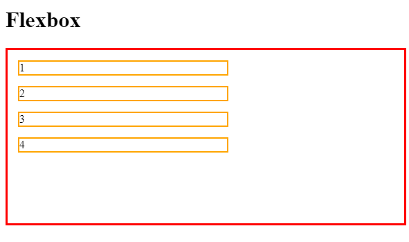
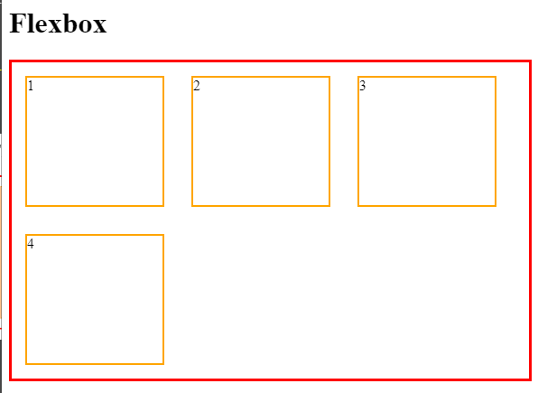

# Justijy-Content, Align-Itens e Align-Content

Dado os códigos:

```
<h1>Flexbox</h1>
<div class="flexbox flex-container1">
    <div class="div1">1</div>
    <div class="div2">2</div>
    <div class="div3">3</div>
    <div class="div4">4</div>
</div>
```
```
.flexbox {
    height: 350px;
    border: 3px solid red;
    margin-bottom: 15px;
    display: flex;
}
.flexbox div {
    border: 2px solid orange;
    width: 150px;
    margin: 15px;
}
.flex-container1 {
    flex-wrap: wrap;
    flex-direction: row;
}
```


Este é o comportamento padrão sem o **Flexbox**:



Mas quando aplicamos o Flexbox ele não afetará o `container`, mas sim os elementos filhos:




### [Menu Flexbox](menu-flexbox.md)