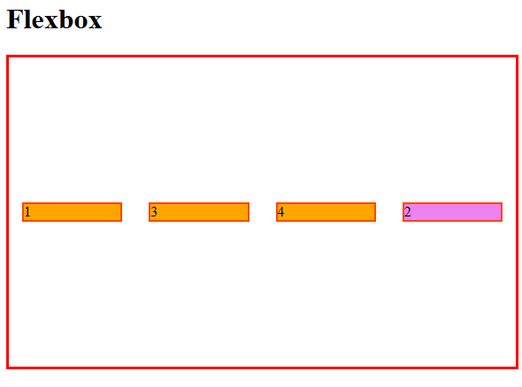
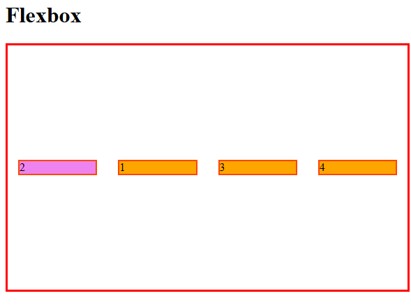

# order

Determina a ordem em que os elementos aparecerão.


Por padrão os flex items são dispostos na tela na ordem do código. Mas a propriedade `order` controla a ordem em que aparecerão no container.

- O valor padrão e "0";

### Exemplo:

```
.flex-container .div2 {
    background-color: violet;
    order: 1;
}
```



- Como o padrão é **0** e o valor do elemento do foi estipulado pra **1**, ele foi para o final do container.

Caso o elemento seja estipulado com `order` de valor **negativo** ele irá para o início do container.

```
.flex-container .div2 {
    background-color: violet;
    order: -1;
}
```




# align-self


Permite que o alinhamento padrão (ou o que estiver definido por *align-items*) seja sobrescrito para ítens individuais.

Por favor veja a explicação da propriedade *align-items* para entender quais são os possíveis valores.

```
.item {
    align-self: auto | flex-start | flex-end | center | baseline | stretch;
}
```

### Exemplo:

```
.flex-container .div2 {
    background-color: violet;
    align-self: self-end;
}
```

### [Menu Flexbox](menu-flexbox.md)
