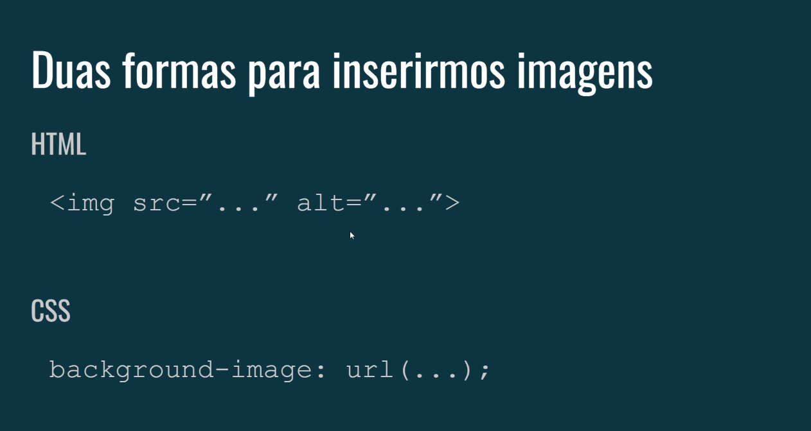
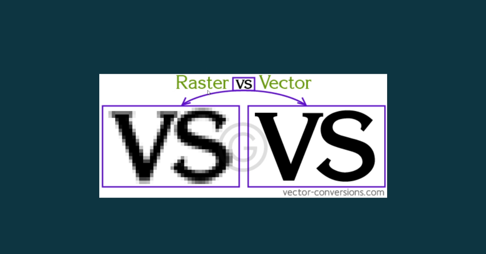
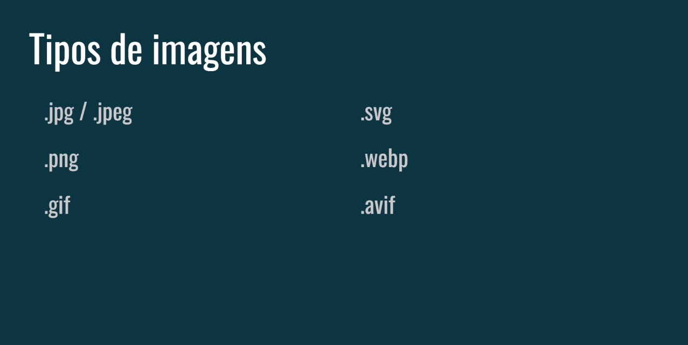

# Inserindo Imagens em HTML e CSS

## Introdução

A inserção de imagens em páginas da web é fundamental para torná-las mais atrativas e informativas. O HTML e o CSS oferecem diferentes maneiras de adicionar imagens aos seus projetos. Neste tutorial, vamos explorar as duas principais formas, as diferenças entre elas e os diversos formatos de imagem disponíveis.

## Inserindo Imagens com HTML



A tag `` é a maneira mais simples e direta de inserir uma imagem em uma página HTML. Ela possui dois atributos principais:

- **src**: Especifica o caminho completo para a imagem.
- **alt**: Fornece um texto alternativo que descreve a imagem, utilizado por leitores de tela e em caso de falha no carregamento da imagem.

### Exemplo:

```

```

### Observações:

- **Caminho da imagem**: O valor do atributo `src` pode ser um caminho relativo (em relação ao arquivo HTML) ou absoluto (um URL completo).
- **Texto alternativo**: O atributo `alt` é essencial para acessibilidade e SEO. Descreva a imagem de forma concisa e informativa.
- **Outros atributos**: A tag ``suporta outros atributos, como `width`, `height`para definir o tamanho da imagem, e `title` para adicionar um texto de dica de ferramenta.

## Inserindo Imagens com CSS

O CSS permite aplicar imagens como fundo de elementos HTML, utilizando a propriedade `background-image`.

### Exemplo:

```
.meu-elemento {
  background-image: url("minha_imagem.jpg");
  background-size: cover; /* Ajusta a imagem para cobrir todo o elemento */
  background-position: center; /* Centraliza a imagem */
}
```

### Observações:

- **Selecionando o elemento**: A propriedade `background-image`é aplicada a um elemento específico, como uma `<div>`, `<header>` ou `<body>`.
- **Outras propriedades**: Além de `background-image`, você pode utilizar outras propriedades como `background-size`, `background-position`, `background-repeat`... Para controlar o tamanho, posição e reprodução da imagem.

## Quando usar HTML e quando usar CSS para inserir imagens?

A escolha entre HTML e CSS para inserir imagens depende do efeito que você deseja alcançar e da estrutura do seu layout. Vamos explorar as diferenças e quando usar cada um:

### Inserindo imagens com HTML ()

- **Quando usar**:
    - **Conteúdo principal**: Quando uma imagem faz parte do conteúdo principal da página, como uma foto de perfil, uma ilustração que acompanha um texto ou uma imagem dentro de um artigo.
    - **Elementos embutidos**: Quando uma imagem precisa ser inserida dentro de um parágrafo ou outra linha de texto.
    - **Elementos semânticos**: Ao usar uma tag ``, você está colocando semanticamente que aquele elemento é uma imagem, o que é importante para acessibilidade e SEO.

### Inserindo imagens com CSS (imagem de fundo)

- **Quando usar**:
    - **Fundo de elementos**: Quando você deseja usar uma imagem como fundo de um elemento, como um cabeçalho, um rodapé ou uma seção específica da página.
    - **Efeitos visuais**: Para criar efeitos visuais como gradientes, padrões repetidos ou imagens que se ajustam ao tamanho do elemento.
    - **Estilização**: Quando a imagem faz parte do estilo visual do elemento, e não do conteúdo principal.

### Resumindo:

|**Caracteristica**|**HTML (``)**|**CSS (imagem de fundo)**|
|-------------------|-----------|-----------------|
|**Função principal**|	Inserir imagem como conteúdo	|Definir imagem como fundo de um elemento|
|**Semântica**|	Indica que o elemento é uma imagem	|Não tem significado semântico para a imagem|
|**Flexibilidade**|	Mais limitado em termos de estilos|	Permite maior controle sobre a aparência da imagem|

### Quando usar um ou outro?

- **Use HTML** quando a imagem for um elemento central do conteúdo e você precisar de controle sobre atributos como `alt`(texto alternativo) e `srcset`(imagens responsivas).
- **Use CSS** quando a imagem for um elemento de design e você precisar de mais flexibilidade para controlar a aparência e o posicionamento da imagem.

### Exemplo prático:

Imagine que você está criando um site de um restaurante. Você poderia usar:

- **HTML**: Para inserir uma foto do prato principal em um cardápio, com um texto alternativo descrevendo o prato.
- **CSS**: Para colocar uma imagem de fundo no cabeçalho do site, com um efeito de paralaxe para criar uma experiência mais envolvente.

### Diferenças entre as Imagens: Raster vs Vector



- **Imagens raster**: Compostas por pixels, as imagens raster (como JPG, PNG, GIF) perdem qualidade quando ampliadas. São ideais para fotografias e gráficos complexos.
- **Imagens horizontais**: criadas a partir de pontos e linhas matemáticas, as imagens variadas (como SVG) podem ser redimensionadas infinitamente sem perda de qualidade. São perfeitas para logotipos, ícones e gráficos simples.

## Formato de imagens

No mundo das imagens digitais, cada formato possui características únicas, ideais para diferentes propósitos. Vamos aprofundar nas principais distinções entre eles:



#### 1. JPG/JPEG:

- **Compressão com perda**: Reduz o tamanho do arquivo, mas com possível perda de detalhes, especialmente em áreas complexas. Ideal para fotos realistas na web, onde o tamanho do arquivo é crucial.
- **Alta compatibilidade**: Suportado por praticamente todos os navegadores e softwares.
- **Núcleos**: Suporta milhões de núcleos (24 bits por pixel), perfeito para fotos coloridas.
- **Transparência**: Não suporta transparência.

#### 2. PNG:

- **Compressão sem perda**: Mantém a qualidade da imagem original, mas o arquivo pode ser maior. Ótimo para logotipos, ícones e imagens com texto nítido.
- **Transparência**: Suporte à transparência total e parcial, ideal para sobreposições e designs web.
- **Núcleos**: Suporta milhões de núcleos (24 bits por pixel), perfeitos para imagens coloridas e com detalhes.
- **Compatibilidade**: Suportado pela maioria dos navegadores e softwares, mas nem todos os programas antigos ou confirmados.

#### 3. GIFs:

- **Compressão com perda**: Ideal para animações simples e com baixo número de núcleos, como logotipos animados e emojis.
- **Tamanho do arquivo**: Arquivos pequenos, perfeitos para carregar rapidamente em sites e mídias sociais.
- **Núcleos**: Suporta até 256 núcleos, limitando a paleta para toneladas específicas.
- **Transparência**: Transparência dura, ou é transparente ou não, não aceita 50%.
- **Animação**: Permite criar animações simples com diversos quadros.

#### 4. SVG:

- **Vetorial**: Imagens compostas por fórmulas matemáticas, escaláveis ​​sem perda de qualidade, perfeitas para logotipos, ícones e ilustrações que precisam ser adaptadas a diferentes tamanhos.
- **Editabilidade**: Altamente editáveis, permitindo modificar núcleos, formas e até conversor para outros formatos.
- **Tamanho do arquivo**: Arquivos geralmente menores que imagens rasterizadas com qualidade semelhante.
- **Transparência**: Apoie a transparência total e parcial.
- **Compatibilidade**: Suportado pela maioria dos navegadores modernos, mas nem todos os programas antigos ou atualizados.

#### 5. WebP:

- **Compressão com perda**: Desenvolvido pelo Google, oferece melhores detalhes que JPG sem sacrificar muita qualidade, ideal para fotos na web.
- **Tamanho do arquivo**: Arquivos menores que JPG com qualidade semelhante.
- **Qualidade**: Boa qualidade para fotos, mas pode apresentar alguns artefatos em áreas complexas.
- **Transparência**: Apoie a transparência.
- **Compatibilidade**: Suportado por navegadores modernos, mas ainda não possui compatibilidade universal como JPG e PNG.

#### 6. Avif:

- **Compressão com perda**: O mais novo formato de imagem do grupo, criado pela Alliance for Open Media, promete ainda melhores atualizações que WebP e JPG, mantendo alta qualidade.
- **Tamanho do arquivo**: Arquivos menores que WebP e JPG com qualidade semelhante.
- **Qualidade**: Excelente qualidade para fotos, com menos artefatos que outros formatos com perda.
- **Transparência**: Apoie a transparência.
- **Compatibilidade**: Suporte ainda em desenvolvimento, mas vem crescendo rapidamente entre navegadores e softwares.


### [Menu Trabalhando com Imagens](menu-imagens.md)