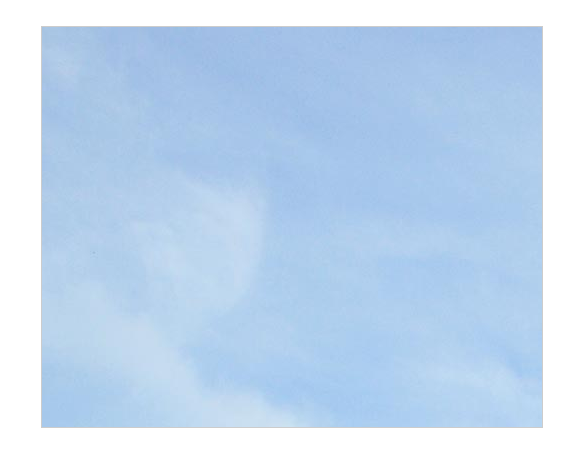
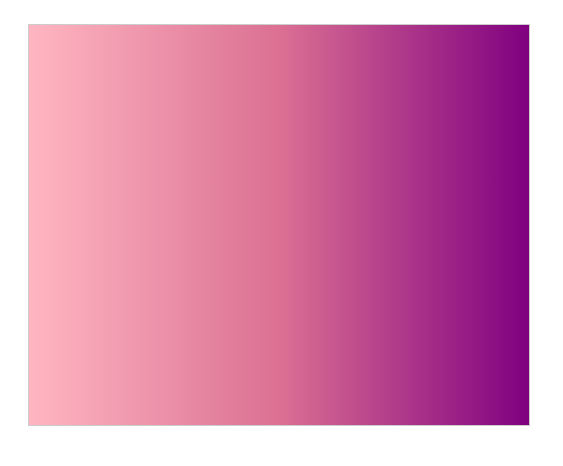

# Alterando o Fundo dos Elementos 

## `background-image` 

Uma propriedade `background-image` em CSS permite que você adicione imagens ao fundo de um elemento. Isso pode ser uma imagem estática, um gradiente ou até mesmo um padrão repetitivo.

### Sintaxe:

```
background-image: url("caminho/para/sua/imagem.jpg");
```

## Tipos de imagens aceitas:

- **Formatos comuns**: JPEG, PNG, GIF, SVG.
- **Formatos modernos**: WebP (compactação de alta qualidade), AVIF (formato de imagem da próxima geração).

### Exemplo:

```
<div class="imagensFundo">
  </div>
```
```
.imagensFundo {
    background-image: url('img/bg.jpg');
}
```



## Gradientes CSS

Gradientes são transições suaves entre duas ou mais cores. O CSS oferece duas formas principais de criar gradientes: linear e radial.

## Gradiente Linear

Cria um gradiente que muda de cor em uma direção linear.

### Sintaxe:

```
background-image: radial-gradient(circle at center, red, blue);
```

- `to right`: Define a direção do gradiente. Pode ser `to top`, `to bottom`, `to left`, `to right`, ou um ângulo em graus.
- `lightpink`, `purple`: As cores de início e fim do gradiente.

### Exemplo:

```
.imagensFundo {
    background-image: linear-gradient(to right, lightpink, palevioletred, purple);
}
```


### Gradiente radial

Cria um gradiente que é irradiado de um ponto central.

Sintaxe:

```
background-image: radial-gradient(circle at center, red, blue);
```

- `circle at center`: Defina a forma do gradiente (círculo) e seu ponto central.
- `red`, `blue`: As cores de início e fim do gradiente.

### Exemplo:

```
.imagensFundo {
    background-image: radial-gradient(circle at center, lightpink, palevioletred, purple);
}
```


## Galeria de Padrões CSS3

O **CSS3 Patterns Gallery** ([https://projects.verou.me/css3patterns/]) é um recurso online incrível que oferece uma vasta coleção de padrões visuais criados apenas com CSS. Você pode encontrar desde padrões simples até designs mais complexos, todos personalizáveis ​​e prontos para serem usados ​​em seus projetos.

### Como usar:

- **Explore a galeria**: Navegue pelos diferentes padrões e encontre aquele que mais te agrada.
- **Copie o código**: Cada padrão tem seu código CSS associado, que você pode copiar e colar diretamente no seu projeto.
- **Personalizar**: Ajuste os núcleos, tamanhos e outras propriedades CSS para adaptar o padrão ao seu design.


### [Menu Trabalhando com Imagens](menu-imagens.md)

