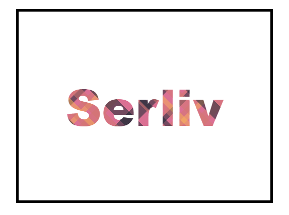

# Propriedade CSSbackground-clip

## O que faz a propriedade background-clip?

Uma propriedade background-clipem CSS controla a área em que uma imagem de fundo é visível. Ela permite que você especifique se a imagem deve ser clicada apenas dentro do conteúdo do elemento, dentro da borda do elemento ou até mesmo fora das bordas do elemento.

## Os valores principais da propriedadebackground-clip

- **border-box**: (valor padrão)
    - A imagem é visível dentro da borda do elemento, incluindo a preenchimento e a borda.
- **padding-box**:
    - A imagem é visível dentro do preenchimento do elemento, excluindo a borda.
- **content-box**:
    - A imagem é visível apenas dentro do conteúdo do elemento, excluindo o preenchimento e a borda.
- **text**:
    - A imagem é visível apenas dentro do texto do elemento.

## Quando usar cada valor

- **border-box**: Ideal para quando você deseja que a imagem se estenda até a borda externa do elemento, incluindo a borda e o preenchimento.
- **padding-box**: Útil para quando você quiser que a imagem se estenda até a borda interna do elemento, incluindo o preenchimento.
- **content-box**: Adequado para quando você deseja que a imagem não se estenda além do conteúdo do elemento, excluindo o preenchimento e a borda.
- **text**: Perfeito para criar efeitos de texto com imagens de fundo.

### Exemplos práticos

### Exemplo 1: Imagem visível dentro da borda (border-box)

```
.element {
  background-image: url('imagem.jpg');
  background-clip: border-box;
}
```

### Exemplo 2: Imagem visível dentro do preenchimento (padding-box)

```
.element {
  background-image: url('imagem.jpg');
  background-clip: padding-box;
}
```

### Exemplo 3: Imagem visível apenas dentro do conteúdo (content-box)

```
.element {
  background-image: url('imagem.jpg');
  background-clip: content-box;
}
```

### Exemplo 4: Imagem visível apenas dentro do texto (texto)

```
.text {
  background-image: url('text-pattern.png');
  background-clip: text;
  -webkit-background-clip: text; /* Para navegadores mais antigos */
}
```

### Combinando com outras propriedades

A propriedade `background-clip` funciona em conjunto com outras propriedades de fundo, como `background-position`, `background-size` e `background-origin`, para criar efeitos mais complexos.

### Exemplo `background-clip: text`:

```
body {
    display: flex;
    align-items: center;
    justify-content: center;
    margin-top: 200px;
    font-family: sans-serif;
  }

  .box {
    color: transparent; /* Make text transparent */
    display: flex;
    justify-content: center;
    align-items: center;
    width: 500px;
    height: 375px;
    border: 5px solid black;
    font-size: 100px;
    font-weight: 900;
    background-color: palevioletred;
    background-image: repeating-linear-gradient(45deg, transparent 5px, hsla(197, 62%, 11%, 0.5) 5px, hsla(197, 62%, 11%, 0.5) 10px,
        hsla(5, 53%, 63%, 0) 10px, hsla(5, 53%, 63%, 0) 35px, hsla(5, 53%, 63%, 0.5) 35px, hsla(5, 53%, 63%, 0.5) 40px,
        hsla(197, 62%, 11%, 0.5) 40px, hsla(197, 62%, 11%, 0.5) 50px, hsla(197, 62%, 11%, 0) 50px, hsla(197, 62%, 11%, 0) 60px,
        hsla(5, 53%, 63%, 0.5) 60px, hsla(5, 53%, 63%, 0.5) 70px, hsla(35, 91%, 65%, 0.5) 70px, hsla(35, 91%, 65%, 0.5) 80px,
        hsla(35, 91%, 65%, 0) 80px, hsla(35, 91%, 65%, 0) 90px, hsla(5, 53%, 63%, 0.5) 90px, hsla(5, 53%, 63%, 0.5) 110px,
        hsla(5, 53%, 63%, 0) 110px, hsla(5, 53%, 63%, 0) 120px, hsla(197, 62%, 11%, 0.5) 120px, hsla(197, 62%, 11%, 0.5) 140px
        ),
        repeating-linear-gradient(135deg, transparent 5px, hsla(197, 62%, 11%, 0.5) 5px, hsla(197, 62%, 11%, 0.5) 10px,
        hsla(5, 53%, 63%, 0) 10px, hsla(5, 53%, 63%, 0) 35px, hsla(5, 53%, 63%, 0.5) 35px, hsla(5, 53%, 63%, 0.5) 40px,
        hsla(197, 62%, 11%, 0.5) 40px, hsla(197, 62%, 11%, 0.5) 50px, hsla(197, 62%, 11%, 0) 50px, hsla(197, 62%, 11%, 0) 60px,
        hsla(5, 53%, 63%, 0.5) 60px, hsla(5, 53%, 63%, 0.5) 70px, hsla(35, 91%, 65%, 0.5) 70px, hsla(35, 91%, 65%, 0.5) 80px,
        hsla(35, 91%, 65%, 0) 80px, hsla(35, 91%, 65%, 0) 90px, hsla(5, 53%, 63%, 0.5) 90px, hsla(5, 53%, 63%, 0.5) 110px,
        hsla(5, 53%, 63%, 0) 110px, hsla(5, 53%, 63%, 0) 140px, hsla(197, 62%, 11%, 0.5) 140px, hsla(197, 62%, 11%, 0.5) 160px
        );
    background-clip: text;
    -webkit-background-clip: text; /* For older browsers */
  }
```



### Dicas adicionais

- **Utilize as ferramentas de desenvolvimento**: Use as ferramentas de desenvolvimento do seu navegador para visualizar e ajustar as propriedades de fundo em tempo real.
- **Considere a compatibilidade**: A propriedade `background-clip: text` pode não ser totalmente suportada em todos os navegadores mais antigos. Verifique a compatibilidade antes de usá-la.

### Conclusão

A propriedade `background-clip` é uma ferramenta útil para controlar a área em que uma imagem de fundo é visível. Ao saber como usar essa propriedade, você poderá criar designs mais personalizados e interessantes.

### [Menu Trabalhando com Imagens](menu-imagens.md)