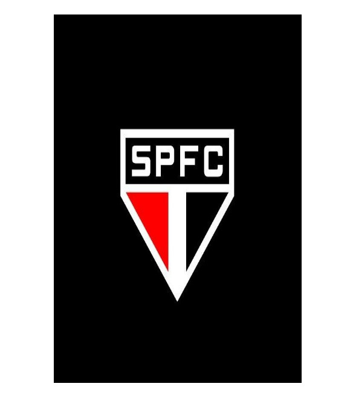
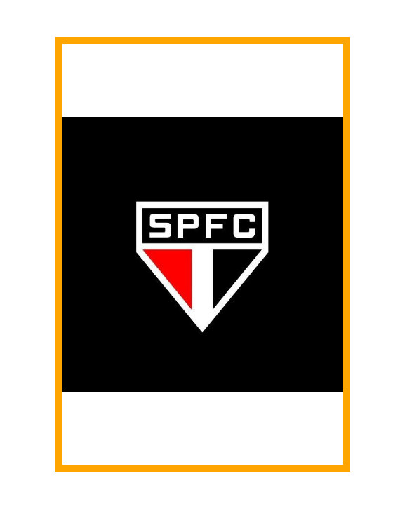
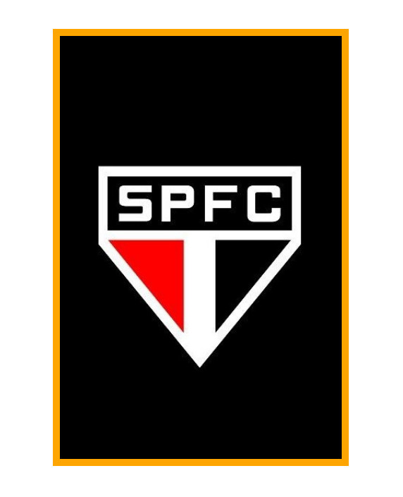
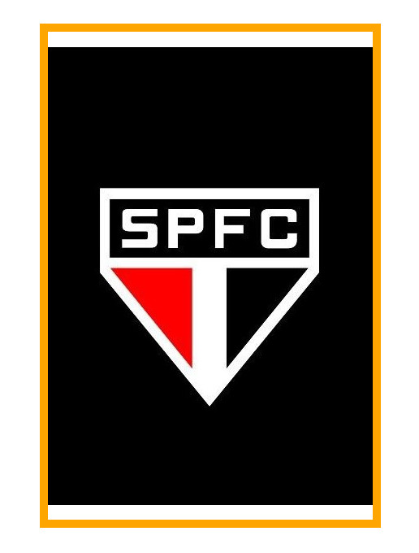
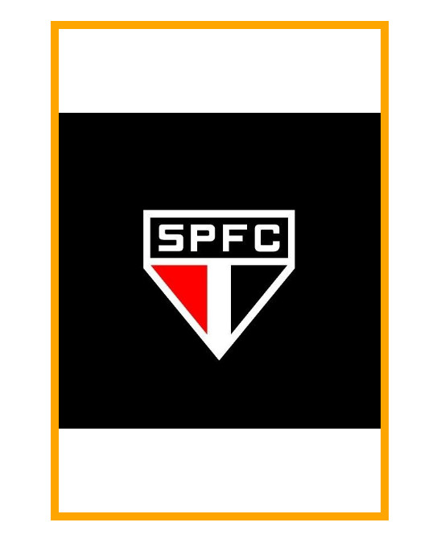

# A Propriedade CSS `object-fit`
A propriedade `object-fit`no CSS é fundamental para controlar como uma imagem é dimensionada e posicionada dentro do seu elemento pai. Ela é especialmente útil quando você precisa ajustar o tamanho de uma imagem para se encaixar em um espaço específico, mantendo suas proporções originais ou não.

## O que faz a propriedade `object-fit`?

A propriedade `object-fit`específica como o conteúdo de um elemento substituído (como uma imagem, vídeo ou iframe) deve ser ajustada à caixa definida pela altura e largura usada.

## Valores de propriedade `object-fit`

- **fill**: Valor padrão. Caso não seja definido outra propriedade, automaticamente a imagem terá o `fill`.



- **contain**: A imagem será redimensionada para caber dentro do elemento pai, mantendo suas proporções originais. Se a imagem for maior que o elemento pai, ela será menor. Se for menor, haverá espaço em branco ao redor dela.

```
.imagem-contain {
    object-fit: contain;
}
```


- **cover**: A imagem será redimensionada para cobrir todo o elemento pai, mantendo suas proporções originais. Se a imagem for menor que o elemento pai, ela será esticada para preencher todo o espaço. Se for maior, partes dela serão cortadas para caber no elemento.

```
.imagem-cover {
    object-fit: cover;
}
```


- **none**: A imagem não será redimensionada. Se ela for maior que o elemento pai, partes dela serão cortadas.

```
.imagem-none {
    object-fit: none;
}
```


- **scale-down**: A imagem será redimensionada para caber dentro do elemento pai, mantendo suas proporções originais. Se a imagem for menor que o elemento pai, ela não será redimensionada.

```
.imagem-scale-down {
    object-fit: scale-down;
}
```


### Quando usar cada valor?

- `contain`: Ideal quando você quer garantir que toda a imagem seja visível e visível em suas proporções, mesmo que haja espaço em branco ao redor.
- `cover`: Perfeito quando você precisa preencher todo o espaço disponível com a imagem, mesmo que partes dela sejam cortadas.
- `none`: Útil quando você quer manter o tamanho original da imagem e não se importa se ela ultrapassar os limites do elemento pai.
- `scale-down`: Bom para garantir que a imagem não fique maior que o elemento pai, mantendo suas proporções.

### Considerações importantes

- **Elementos substituíveis**: A propriedade `object-fit` funciona com elementos como `img`, `video`, `iframe` e outros elementos que podem exibir conteúdo externo.
- **Responsividade**: Combine `object-fit` com media queries para criar layouts responsivos que se adaptem a diferentes tamanhos de tela.
- **Compatibilidade**: A propriedade `object-fit` é amplamente suportada em navegadores modernos.

### Em resumo:

A propriedade `object-fit` é uma ferramenta poderosa para controlar o dimensionamento e o posicionamento de imagens em seus layouts CSS. Ao entender os diferentes valores e suas aplicações, você poderá criar designs mais flexíveis e responsivos.

### [Menu Trabalhando com Imagens](menu-imagens.md)

