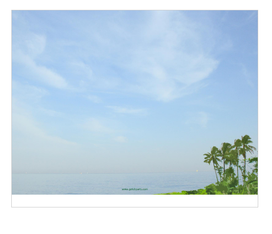
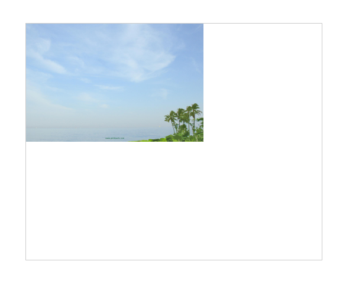

# Propriedade CSS `background-size`

## O que faz a propriedade `background-size`?

A propriedade `background-size` em CSS controla o tamanho da imagem de fundo de um elemento. Ela permite que você ajuste a imagem para se encaixar perfeitamente no elemento, esticá-la, cortar ou até mesmo repetir um padrão. Isso é fundamental para criar layouts personalizados e visuais visíveis em suas páginas web.

## Os valores principais da propriedade`background-size`

- **auto**: (valor padrão)
    - A imagem é exibida em seu tamanho natural. Se a imagem for maior que o elemento, ela será cortada.
- **cover**:
    - A imagem é redimensionada para cobrir toda a área do elemento, mantendo suas proporções originais. Partes da imagem podem ser cortadas para preencher completamente o espaço.

### Exemplo:

```
.imagensFundo {
    background-image: url('img/bg.jpg');
    background-size: cover;
}
```


- **contain**:
    - A imagem é redimensionada para caber dentro do elemento, mantendo suas proporções originais. Pode haver espaços em branco ao redor da imagem se ela for menor que o elemento.

### Exemplo:

```
.imagensFundo {
    background-image: url('img/bg.jpg');
    background-size: contain;
}
```



## Tamanhos de medida

Você também pode definir o tamanho da imagem usando valores específicos, como pixels (px), porcentagens (%) ou outras unidades de medida:

- **Pixels (px)**: Defina um tamanho exato em pixels.
- **Porcentagens (%)**: Define o tamanho em relação ao tamanho do elemento pai.
- **Outras unidades**: Como em, cm, mm, etc.

### Exemplo:

```
.imagensFundo {
    background-image: url('img/bg.jpg');
    background-size: 300px 200px;
}
```


### Diferentes camadas de `background-size`

É possível aplicar a propriedade `background-size` em diferentes camadas de imagem de fundo. Para isso, você pode usar a notação de várias camadas:

```
.elemento {
  background-image: url('imagem1.jpg'), url('imagem2.jpg');
  background-size: cover, contain; /* Aplica 'cover' à primeira imagem e 'contain' à segunda */
  background-position: center; /* Centraliza as imagens */
}
```

## Quando usar cada valor

- **auto**: Ideal para quando você desejar que a imagem mantenha seu tamanho original e não se preocupe com o preenchimento do elemento.
- **cover**: Perfeito para criar um efeito de hero image, onde a imagem cobre toda a área do elemento, mesmo que parte dela seja cortada.
- **contém**: Útil quando você quer garantir que uma imagem inteira seja visível dentro do elemento, mesmo que haja espaços em branco ao redor.
- **Tamanhos de medida**: Permite um controle preciso sobre o tamanho da imagem e é ideal para criar layouts personalizados.

### Exemplos práticos

- **Imagem do herói**:

```
.hero {
  background-image: url('hero-image.jpg');
  background-size: cover;
  height: 500px;
}
```

- **Padrão de ladrilho**:

```
.tile {
  background-image: url('tile.png');
  background-size: 50px 50px;
}
```

- **Imagem de fundo responsivo**:

```
.image-container {
  background-image: url('responsive-image.jpg');
  background-size: contain;
}
```

Com a propriedade `background-size`, você tem um controle preciso sobre o tamanho e a aparência das imagens de fundo em seus projetos web, permitindo criar designs mais personalizados e visualmente atraentes.

### [Menu Trabalhando com Imagens](menu-imagens.md)