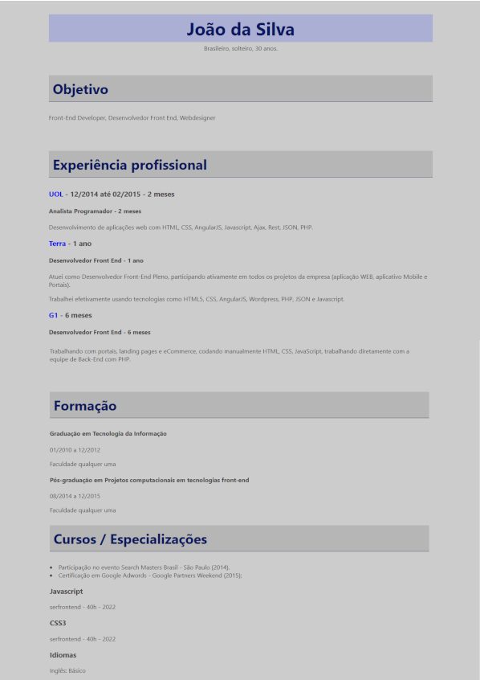

# Desafio Currículo

O desafio era construir um currículo com os conhecimentos básicos adquiridos com aulas de HTML e CSS 

<h2> 🚀 Tecnologias

 
    
    
    

</h2>

### [Código do desafio](desafio-curriculo.html)

### [Menu Introdução ao CSS](menu_introducao-CSS.md)