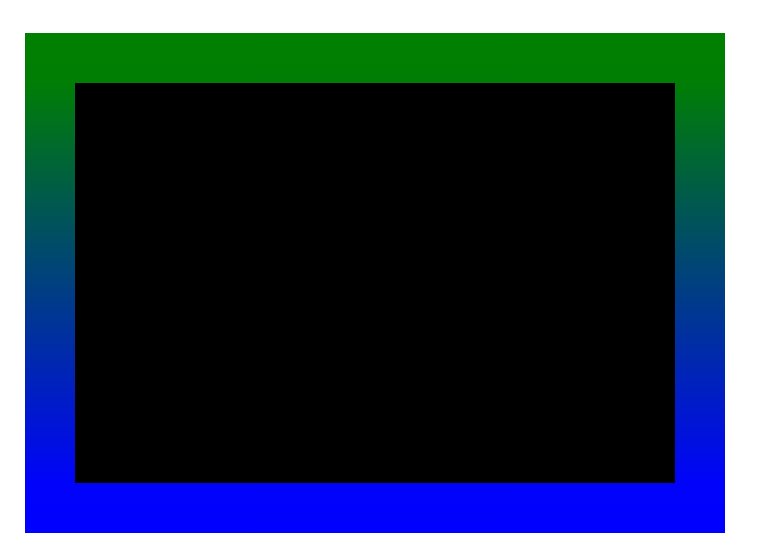

# Propriedade `border-image`

## `border-image-source`

- **Finalidade**: Especifica a imagem que será usada para criar a borda.
- **Valores**:
    - **URL**: Uma URL apontando para o arquivo de imagem.
    - **Palavra-chave**: `none` : Nenhuma imagem será usada.

- **Exemplo**:

```
.element {
    border-image-source: url("image.png");
}
```


Além da url externa, também possível definir um borda Gradiente:

```
.exemplo-2 {
    border-image-source: linear-gradient(green, blue);
}
```


## `border-image-slice`

A propriedade CSS `border-image-slice` divide a imagem especificada por em regiões. Essas regiões formam os componentes da borda de um elemento image.


- **Finalidade**: Define a parte da imagem que será usada para a borda.
- **Valores**:
    - **Número**: Um único valor representa o mesmo valor de fatia para todos os quatro lados.
    - **Quatro números**: especifica os valores de fatia para os lados superior, direito, inferior e esquerdo, respectivamente.
    - **Palavra-chave**: `fill` : A imagem inteira será usada para a borda.

- **Exemplo**:

```
.exemplo-1 {
    border-image-source: url('img/dinossauros.png');
    border-image-slice: 184;
    border-image-repeat: round;
}
```


- **Importante**: já definir a propriedade `border-image-repeat` para que o imagem tenha um comportamento adequado.

### Borda com gradiente

```
.exemplo-2 {
    border-image-source: linear-gradient(green, blue);
    border-image-slice: 10;
}
```



## `border-image-width`

- **Objetivo**: Define a largura da borda.
- **Valores**:
    - **Número**: Um único valor representa a mesma largura para todos os quatro lados.
    - **Quatro números**: especifica as larguras dos lados superior, direito, inferior e esquerdo, respectivamente.
    - **Palavra-chave**: `auto` : A largura será calculada com base nos valores da imagem e do corte.

- **Exemplo**:

```
.exemplo-1 {
    border-image-source: url('img/dinossauros.png');
    border-image-slice: 184;
    border-image-repeat: round;
    border-image-width: 50px;
}
```

## `border-image-repeat`

- **Finalidade**: Determina como a imagem é repetida ao longo da borda.
- **Valores**:
    - **Palavra-chave**: `stretch` : A imagem é esticada para se ajustar à largura da borda.
    - **Palavra-chave**: `repeat` : A imagem é repetida horizontalmente e verticalmente.
    - **Palavra-chave**: `round` : A imagem é repetida tantas vezes quanto possível sem esticar ou dividir.
    - **Palavra-chave**: `space` : A imagem é repetida com espaços iguais entre as instâncias.

- **Exemplo**:

```
.exemplo-1 {
    border-image-source: url('img/dinossauros.png');
    border-image-slice: 184;
    border-image-repeat: round;
    border-image-width: 50px;
}
```

## `border-image-outset`

- **Finalidade**: Especifica a distância entre a borda e a imagem.
- **Valores**:
    - **Número**: Um único valor representa o mesmo início para todos os quatro lados.
    - **Quatro números**: especifica os inícios para os lados superior, direito, inferior e esquerdo, respectivamente.

- **Exemplo**:

```
.exemplo-1 {
    border-image-source: url('img/dinossauros.png');
    border-image-slice: 184;
    border-image-repeat: round;
    border-image-width: 50px;
    border-image-outset: 50px;
}
```


## Combinando as Propriedades

Para criar uma borda usando uma imagem, você normalmente combinará estas propriedades:
 
1. **`border-image-source`**
2. **`border-image-slice`**
3. **`border-image-repeat`**

### Sintaxe

```
border-image: source slice repeat
```

- Para se definir o width, adicione uma barra `/` após o `slice`.

```
border-image: source slice / width  repeat
```
- Para adicionar o `source`, adicinar a barra `/` após o `width`

```
border-image: source slice / width / source  repeat
```

### Exemplo: 

```
.exemplo-1 {
    border-image: url('img/dinossauros.png') 184 / 50px / 50px round;
}
```


O resultado é o mesmo que aplicando as propriedades uma a uma.

### [Menu Introdução ao CSS](menu_introducao-CSS.md)