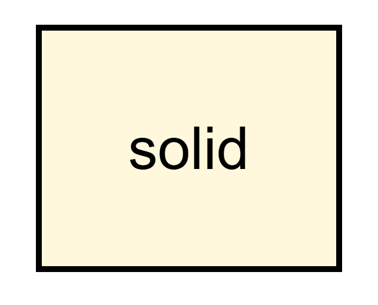
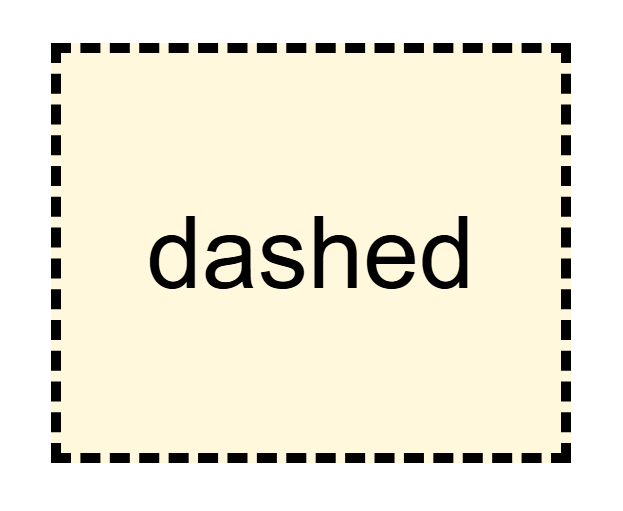
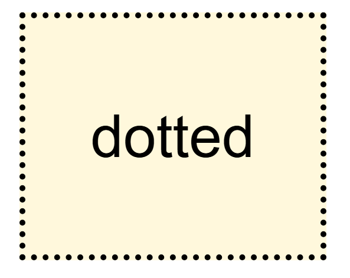
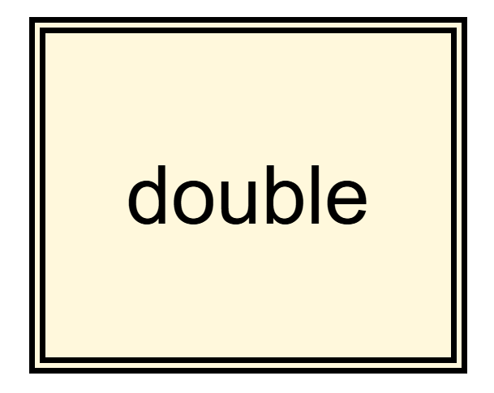
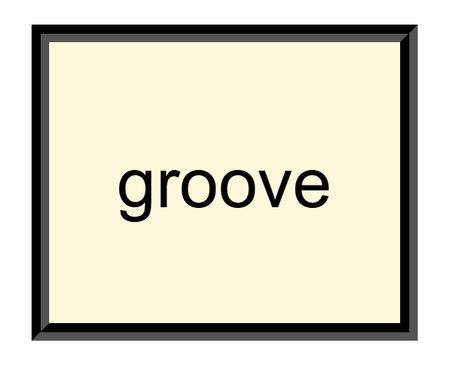
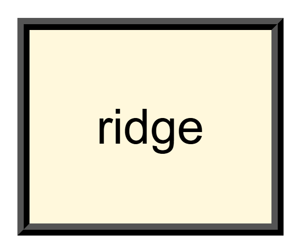
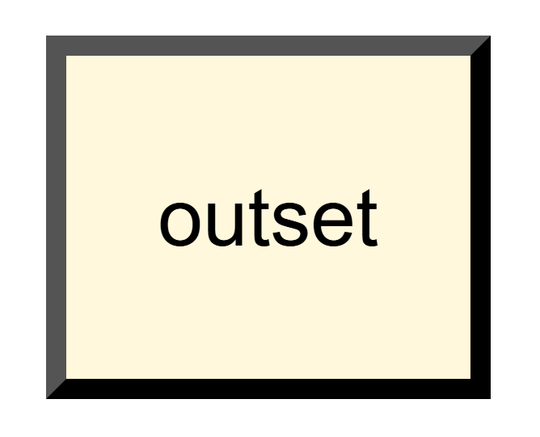
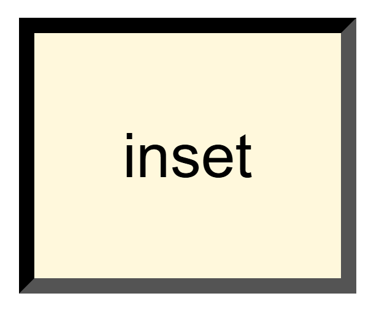

# Propriedade CSS border

## O que é uma propriedade CSS `border`?

A propriedade `border` em CSS é utilizada para definir a borda de um elemento HTML. Ela permite controlar a espessura, o estilo e a cor da borda.

## Sintaxe básica:

```
border: width style color;
```

- **width**: Define a espessura da borda.
- **style**: Define o estilo da borda (sólido, tracejado, pontilhado, etc.).
- **color**: Defina a cor da borda.

## Os principais estilos `border-style`

A propriedade `border-style` é responsável por definir o estilo da borda. Vamos explorar os estilos mais comuns:

- ### solid: Cria uma borda sólida e contínua.



- ### dashed: Cria uma borda composta por linhas tracejadas.



- ### dotted: Cria uma borda composta por pontos.



- ### double: Cria uma borda dupla.



- ### groove: Cria uma borda com efeito de sulco.



- ### ridge: Cria uma borda com efeito de crista.



- ### outset: Cria uma borda com efeito de recuo.



- ### inset: Cria uma borda com efeito de relevo.



## Personalizando ainda mais as bordas

Além de `border-style`, você pode personalizar ainda mais as bordas usando as seguintes propriedades:

- **border-width**: Define a espessura da borda para cada lado individualmente (superior, direita, inferior, esquerda).
- **border-color**: Define a cor da borda para cada lado individualmente.
- **border-radius**: Cria bordas arredondadas.

## Demonstração visual

Para visualizar os diferentes estilos de borda e suas modificações, você pode usar um editor de código com visualização ao vivo ou ferramentas online como o CSS-Tricks.


### [Menu Introdução ao CSS](menu_introducao-CSS.md)