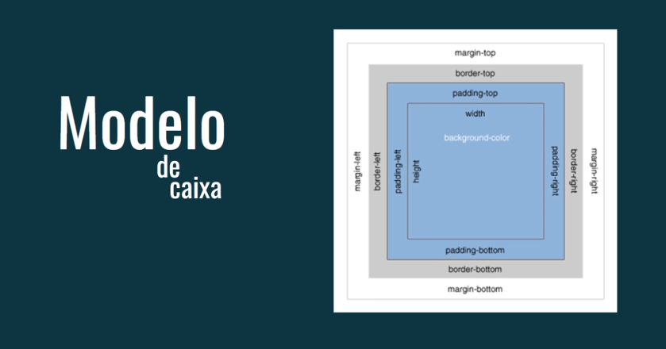

# Entendendo o Border Box no CSS

## O que é o Border Box?



No CSS, cada elemento HTML é renderizado como uma caixa. Essa caixa é definida pelo modelo de caixa (box model), que descreve a estrutura interna de um elemento e como ele interage com os elementos ao seu redor. O border box é uma das duas principais maneiras de interpretar esse modelo.

### Imagine uma caixa com várias camadas:

- Conteúdo: O texto, imagem ou outro conteúdo do elemento.
- Preenchimento (preenchimento): O espaço entre o conteúdo e a borda.
- Borda: Uma linha que delimita o elemento.
- Margem: O espaço entre a borda do elemento e os elementos vizinhos.

O border box define a largura e a altura que você atribui a um elemento que inclui todas essas partes: **conteúdo, preenchimento e borda**. Isso significa que se você definir a largura de um elemento como 200px, esses 200px incluem o conteúdo, o preenchimento e a borda.

### Por que usar o Border Box?

- **Facilita o layout**: Ao definir a largura total de um elemento, você já sabe exatamente quanto espaço ele ocupará na página, sem precisar calcular o preenchimento e a borda separadamente.
- **Evite problemas de dimensionamento**: Quando você adiciona padding ou borda a um elemento, a largura total pode aumentar, causando sobreposições indesejadas. O border box evita esse problema.
- **Padronização**: Muitos frameworks CSS utilizam o border box por padrão, o que facilita a criação de layouts consistentes.

## 1. Width e Height

- **Definição**: Determinam a largura e a altura total do elemento, incluindo todas as suas partes (conteúdo, padding, borda e, no caso do border box, também a margem).
- **Exemplo**:

```
.box {
  width: 200px;
  height: 150px;
  box-sizing: border-box;
}
```
Neste exemplo, uma caixa terá exatamente 200px de largura e 150px de altura, independentemente do valor do padding e da borda.

## 2. Padding

- **Definição**: Define o espaço entre o conteúdo e a borda do elemento.
- **Propriedades**: `padding-top` , `padding-right`, `padding-bottom`, `padding-left` ou `padding`(para aplicar o mesmo valor a todos os lados).
- **Exemplo**:

```
.box {
  padding: 20px;
}
```
Isso adicionará 20px de espaço entre o conteúdo e a borda em todos os lados da caixa.

## 3. Margin

- **Definição**: Define o espaço entre a borda do elemento e os elementos vizinhos.
- **Propriedades**: `margin-top` , `margin-right`, `margin-bottom`, `margin-left` ou `margin`(para aplicar o mesmo valor a todos os lados).
- **Exemplo**:

```
.box {
  margin: 10px;
}
```

Isso adicionará 10px de espaço entre a caixa e os elementos ao redor.

## 4. Border

- **Definição**: Define a borda do elemento.
- **Propriedades**: `border-width` , `border-style`, *`border-color`*.
- **Exemplo**:

```
.box {
  border: 2px solid black;
}
```

Isso criará uma borda sólida preta de 2px de espessura ao redor da caixa.

### Como o Border Box funciona na prática

Quando você define a largura de um elemento como 200px usando o border box, esses 200px incluem:

- O espaço ocupado pelo conteúdo.
- O preenchimento interno.
- A espessura da borda.
**Importante**: A margem não está incluída na largura e altura definidas para o elemento, ela cria espaço entre os elementos.

### Vantagens de usar o Border Box?

- **Facilidade de criação de layouts**: Ao definir a largura total de um elemento, você já sabe exatamente quanto espaço ele ocupará na página.
- **Evita cálculos complexos**: Não é necessário calcular a largura total com base no conteúdo, preenchimento e borda.
- **Padronização**: Muitos frameworks CSS utilizam o border box por padrão.

**Em resumo**, o border box é uma ferramenta poderosa para criar layouts mais precisos e consistentes no CSS. Ao entender como as propriedades `width`, `height`, `padding`, `border`e `margin`interação no modelo de caixa, você terá mais controle sobre a aparência de seus elementos.


### [Menu Introdução ao CSS](menu_introducao-CSS.md)

