# Box Model

## Entendendo como funciona o Box Model e o Box Sizing

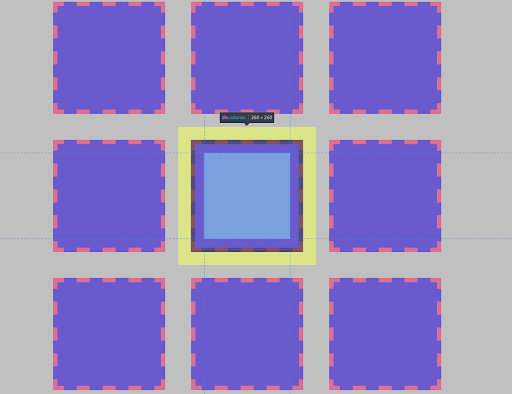

Você já se deparou com algum site ou aplicação web onde os elementos parecem estar desalinhados, com tamanho desproporcional, componentes que não seguem um padrão, ou até o clássico problema da responsividade, de quando abrimos um mesmo site em diferentes dispositivos (smartphone, tablet) e o layout aparece todo desordenado?

## Box Model - O modelo em caixa

Vamos desenvolver o layout a seguir juntos:


O primeiro passo será a montagem do documento HTML:

```
<div>
<h1>Título</h1>
     <p>
     Mussum Ipsum, cacilds vidis litro abertis. Quem manda na minha terra sou euzis! Praesent vel viverra nisi. Mauris aliquet nunc non turpis scelerisque, eget. Copo furadis é disculpa de bebadis, arcu quam euismod magna. Delegadis gente finis, bibendum egestas augue arcu ut est.
      </p>
</div>
```

Ao abrir o navegador, temos esse resultado:

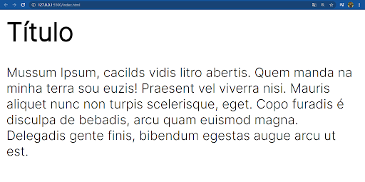

Em seguida, com o CSS, adicionamos a fonte que será utilizada, as cores dos elementos e definimos uma largura e altura para a nossa tag `div`, a fim de facilitar sua visualização.

No CSS, teremos:

```
* {
    font-family: 'Inter', sans-serif;
    color: #fff;
}
body {
    background-color: #b5c5ea;
}
div {
    background-color: #476ECC;
    width: 400px;
    height: 400px;
}
```

Agora, nossa página está desse jeito:

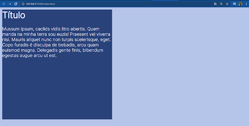

É notável que, apesar da aplicação de alguns estilos, o resultado ainda está longe do que foi proposto no layout. A distância entre a nossa caixa (margem) e a tela é muito pequena. O texto está colado na lateral da caixa e isso é um problema.

Devemos lembrar, que mesmo não declarando a propriedade margem no CSS, o próprio navegador adiciona valores para a margem padrão aos elementos na tela. Veja isso na prática: abra o DevTools do Google Chrome (pode ser pelo atalho `ctrl + shift + I` ou clique com o botão direito do mouse e escolha a opção `inspecionar`) e confira a tag `h1`:

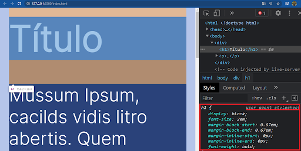

Como foi destacado no canto inferior direito da imagem anterior, temos a frase sublinhada: **user agent stylesheet** e, logo abaixo, algumas propriedades.

Como mencionado anteriormente, estas são as propriedades padrão que o navegador aplica na tag `h1`. Lembrando que cada tag tem seu próprio estilo padrão, ou seja, se eu escolhesse a tag `p` veríamos certamente diferentes propriedades e valores sendo utilizados.

## A propriedade Margin do Box Model

Para darmos início ao ajuste do nosso layout, começamos adicionando a propriedade `margin` à nossa tag div, pois ela é o nosso elemento primário e as tags h1 e p que estão dentro dela são as secundárias. A propriedade `margin` é o espaçamento externo do elemento (distância entre o elemento e o canto da tela, ou se tivermos mais elementos na tela, poderíamos dizer também que é a distância entre um elemento e outro). Ela aceita valores absolutos (`px, cm, mm...`) ou valores relativos (`rem, vh, vw, %...`). Ao utilizar a propriedade `margin`, temos 4 valores: `margin-top` é a distância entre o elemento e o canto superior da tela; `margin-right`, distância entre o elemento e o canto direito da tela; `margin-bottom`, distância entre o elemento e o canto inferior da tela, e `margin-left`, distância entre o elemento e o canto esquerdo da tela.

Se declararmos somente a propriedade `margin`, estaremos usando um shorthand, ou seja, uma propriedade abreviada, que nos permite escrever menos código.

Utilizei o shorthand para declarar a margem da tag div:

```
div {
    background-color: #2a427a;
    margin: 50px auto;
}
```

E, como resultado, teremos:

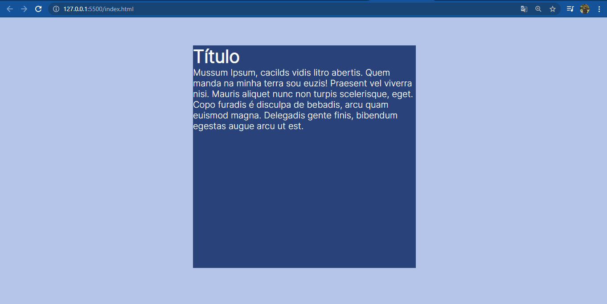

Ao utilizarmos o shorthand, foram passados dois valores para a propriedade `margin`. `50px`, para `margin-top` e `margin-bottom`, e `auto`, para `margin-left` e `margin-right`. Apesar de termos conseguido distanciar a `div` do canto da tela, como proposto no layout, ainda temos o texto (`p` e `h1`) colado no limite da nossa `div`.

## A propriedade Padding do Box Model

Como distanciamos a `div` do canto da tela, agora precisamos adicionar uma distância entre o texto e a borda da nossa `div`. Para isso, faremos no CSS o seguinte:

```
h1, p {
    padding: 30px 50px;
}
```

Para que possamos distanciar os elementos dentro da div, utilizamos a propriedade `padding`, que é o **espaçamento interno** dos elementos. Assim como a propriedade margin, nós também temos os valores de `top`, `right`, `bottom` e `left`. Também podemos usar o shorthand, como utilizamos na propriedade margin. No código anterior, ao definirmos somente dois valores, demonstramos que o espaçamento interno superior (`top`), e o espaçamento interno inferior (`bottom`), terá 30px e o espaçamento lateral esquerdo (`left`) e o direito (`right`) terá `50px`.

Como resultado do código CSS acima, temos:

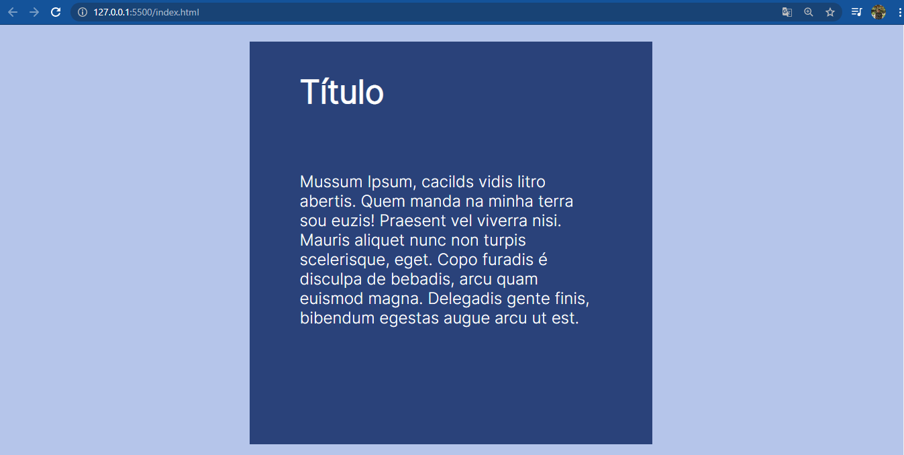

## A propriedade Border do Box Model

Usando as propriedades `margin` e `padding`, conseguimos chegar próximo do layout pedido, faltando somente a borda do título. Para colocarmos uma borda, selecionaremos a tag `h1` e utilizaremos a propriedade border. Temos no CSS abaixo:

```
h1 {
    border: 10px solid #fff;
    border-radius: 60px;
}
```

A propriedade `border` é responsável pela inserção de borda em nossos elementos. Definimos que a borda terá 10px de largura, o seu estilo será solid, a cor `#fff` com a propriedade `border-radius` e que o arredondamento da nossa borda será de `60px`. Vale a pena conhecer as diversas forma de aplicação da propriedadeborder, assim como a propriedade `border-radius`. Abaixo, veja o resultado da aplicação da propriedade border que foi feito acima:

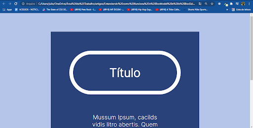

A propriedade `border` aceita vários valores que definem como características da borda:

- `dotted-` Define uma borda pontilhada
- `dashed-` Define uma borda tracejada
- `solid-` Define uma borda sólida
- `double-` Define uma borda dupla
- `groove-` Define uma borda ranhurada 3D. O efeito depende do valor border-color
- `ridge-` Define uma borda 3D com sulcos. O efeito  depende do valor border-color
- `inset-` Define uma borda de inserção 3D. O efeito depende do valor border-color
- `outset-` Define uma borda de início 3D. O efeito depende do valor border-color
- `none-` Não define nenhuma fronteira
- `hidden-` Define uma borda oculta

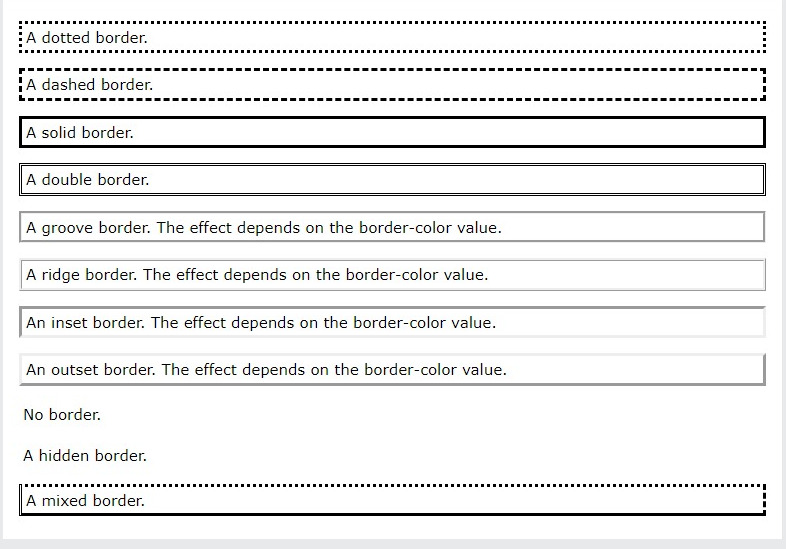

## A propriedade `outline` do Box Model

Um contorno de uma linha desenhada ao **redor** dos elementos, **FORA das bordas**, para fazer o elemento "se destacar".

A propriedade `outline` aceita vários valores para definir suas características:

- `outline-color`: Define um cor da linha de contorno (padrão`: ou ). invertcurrentcolor
- `outline-style`: Define o estilo da linha (padrão: )`: none
- `none`: sem contorno
- `solid`: linha sólida
- `dotted`: linha pontilhada
- `dashed`: linha de defesa
- `double`: linha dupla
- `outline-width`: Define a espessura da linha (padrão: ). - medium
- `outline-offset`: Define a distância entre a linha e a borda do elemento (padrão: ). 0

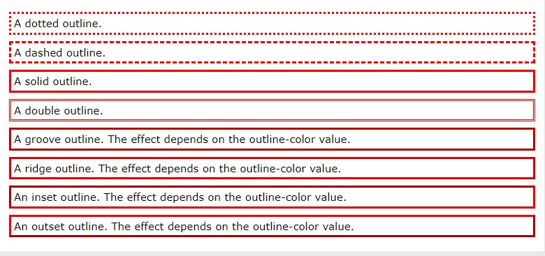

## Box Model

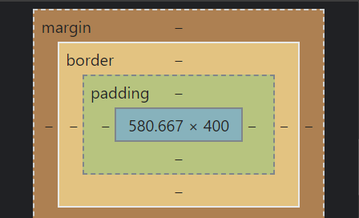

Para a solução do problema apresentado ao longo deste artigo, utilizamos um conceito do CSS que se chama **Box Model**, que é a representação do elemento HTML (as tags) em um bloco retangular, que está dividido em 4 partes: **conteúdo**, **espaçamento interno** (propriedade `padding`), a **borda** (propriedade `border`) e a **margem** (propriedade `margin`)

## Elementos não ficam com o tamanho que foi definido na folha de estilo

Devemos sempre ter atenção às definições do CSS, por exemplo: se tag `div` necessita de uma largura 400px (`width: 400px;`) e altura de 400px (`height: 400px`), com isso, esperamos que o elemento tenha exatamente o tamanho que definimos, certo? Depende! Neste caso, a tag possui exatamente o tamanho que foi definido.

Mas se tivéssemos aplicado, por exemplo, um padding para nossa tag `div`:

```
padding: 30px 50px;
```

Teríamos a nossa `div` com 500px de **largura**, e não os 400px que foi definido. E por que isso acontece? Como atribuímos 50px para `padding-left` e `padding-right`, estes valores são somados a largura que foi estabelecida, desta forma temos: 400px (**largura definida**) + 50px (**padding left**) + 50px (**padding right**) = 500px de largura. No caso da altura, o valor determinado de **padding-top** e **padding-bottom** de 30px é somado a largura de 400px que foi definida e, com isso, chegamos ao valor de 460px.

Isso é terrível, porque, se definimos altura e largura para um elemento, queremos aquilo que delimitamos, e não que mude quando adicionamos padding e border.

Para resolver este problema, basta adicionar a linha a seguir no estilo da nossa tag `div`:

```
box-sizing: border-box;
```

## A solução mágica: box-sizing e border-box

Como sabemos, o CSS3 trouxe várias novidades que facilitam o desenvolvimento dos nossos layouts e, junto dele, veio a propriedade ´box-sizing´, que possibilita a modificação da forma que o tamanho do elemento é calculado no CSS.

O valor padrão desta propriedade é **content-box**, que considera os valores das propriedades ´border´ e ´padding´ para calcular o tamanho que o elemento ocupa na tela. Porém, ao definirmos ´box-sizing: border-box´, há alteração no cálculo padrão que conhecemos, fazendo com que o navegador passe a considerar a altura e largura do elemento contando o ´padding´ e o ´border´ do elemento.

<div style="backgrond: white">
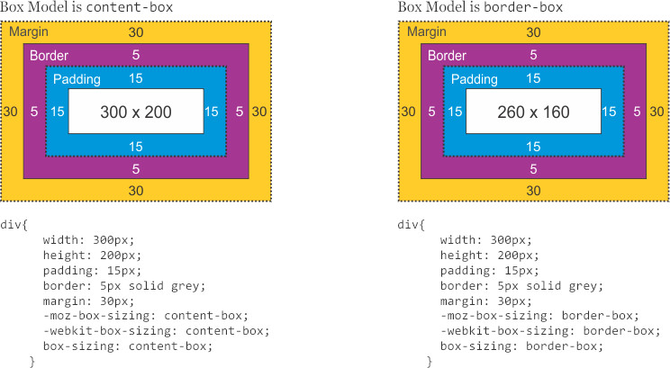
</div>

Essa propriedade torna menos trabalhosa a construção de layouts responsivos, pois temos a garantia que os elementos terão o exato tamanho que definimos, resolvendo o maior problema do box model padrão, (`content-box`) que soma a altura e largura aos valores definidos em `padding` e `border`.


### [Voltar ao Menu-Principal](../README.md)

